# 激光
> 墙外资料整理、学习&备份；资源来源于网络，仅个人使用。【[来源](http://www.swissrocketman.fr/)】   
- 
 By | 2020 &nbsp;&nbsp;&nbsp;&nbsp;

---
## 参考
> [rp-photonics](https://www.rp-photonics.com/lasers.html) 
> [图片](https://www.flickr.com/photos/100053860@N08/) &nbsp;&nbsp; 
> [swissrocketman](http://www.swissrocketman.fr/)  
---
## 简介

名称|旧资源|PDF
--|:--:|:--:
<a href="./sources/laser/pdf/RUBY LASERS old data sheet.pdf" target="_blank">红宝石激光器</a>|<a href="./sources/laser/pdf/Ultrafast semiconductor lasers.pdf" target="_blank">超快半导体激光器</a>|<a href="./sources/laser/pdf/Diodes lasers.pdf" target="_blank">LD激光二极管</a>
<a href="./sources/laser/pdf/High energy QED with lasers.pdf" target="_blank">高能QED</a>|<a href="./sources/laser/pdf/Yoctosecond light flash.pdf" target="_blank">Yocto脉冲</a>|<a href="./sources/laser/pdf/Ultra high Intensity Laser Acceleration of Ions To MeV Energies.pdf" target="_blank">超强激光加速</a>
<a href="./sources/laser/pdf/Aurora.pdf" target="_blank">极光</a>|<a href="./sources/laser/pdf/High Harmonics and sub attosecond pulses in Relastivic Regime.pdf" target="_blank">阿秒脉冲</a>|<a href="./sources/laser/pdf/Laser Diode Arrays.pdf" target="_blank">LD bar条阵列</a>
<a href="./sources/laser/pdf/Relastivic mirror.pdf" target="_blank">Relastivic</a>|<a href="./sources/laser/pdf/Ultra High Field.pdf" target="_blank">高场强激光</a>|<a href="./sources/laser/pdf/Laser diode mount.pdf" target="_blank">LD Mount</a>
<a href="./sources/laser/pdf/Laser particle acceleration.pdf" target="_blank">粒子加速</a>|<a href="./sources/laser/pdf/Extrem light Mourou.pdf" target="_blank">Extrem light</a>|<a href="./sources/laser/pdf/Short Pulse Amplification.pdf" target="_blank">短脉冲放大</a>
<a href="./sources/laser/pdf/Miroirs plasma Raman.pdf" target="_blank">拉曼放大</a>|<a href="./sources/laser/pdf/Raman Amplifier for Exawatts Lasers.pdf " target="_blank">拉曼放大器</a>|<a href="./sources/laser/pdf/Ultra fast laser pulses.pdf" target="_blank">超短脉冲</a>
<a href="./sources/laser/pdf/Short pulse laser sources.pdf" target="_blank">短脉冲光源</a>|<a href="./sources/laser/pdf/High power Ti sapphire laser.pdf" target="_blank">高功率钛蓝宝石</a>|<a href="./sources/laser/pdf/Bose-Einstein-Condensat of positronium to pump a gamma ray laser.pdf" target="_blank">BEC凝聚</a>
<a href="./sources/laser/pdf/Two and a Half Peaks.pdf" target="_blank">双半峰</a>|<a href="./sources/laser/pdf/high power fiber lasers.pdf" target="_blank">光纤激光器放大器</a>|<a href="./sources/laser/pdf/ACourjaud_lasers_femto_puissance.pdf" target="_blank">薄盘激光</a>

 

---
## 应用

### 倍频  
- PDF：<a href="./sources/laser/pdf/EXP0578.pdf" target="_blank">二次谐波的产生</a>  

- 1030nm的红外激光束穿过BBO晶体，相位匹配产生515nm的绿光，观察到不匹配时480nm的蓝光。   
<video id="video" controls="ture" preload="none" poster="./sources/laser/The Wonder of Phase Matching.jpg" width="75%" x5-video-player-type="h5" >
<source id="mp4" src="./sources/laser/video/The Wonder of Phase Matching.mp4" type="video/mp4">
</video>   
- DPSS激光器二谐波的产生。   
<video id="video" controls="ture" preload="none" poster="./sources/laser/DPSS Lasers and Second Harmonic Generation.jpg" width="75%" x5-video-player-type="h5" >
<source id="mp4" src="./sources/laser/video/DPSS Lasers and Second Harmonic Generation.mp4" type="video/mp4">
</video>   
- HIPPO 1064-17   
12W绿光50khz、12ns 20kW。
W型腔，每条臂由25W LD 光纤耦合透镜泵浦Nd:YVO4 ，2个Q开关组成。  
  
---

### 其他
- UP CONVERSION    
  

- 空气光学击穿，强度取决于脉冲持续时间；使介质局部电离，等离子体密度达到临界值，急剧膨胀，形成冲击波。  

   
液体中光学击穿， 等离子体、冲击波等。   
  

- 激光诱导成丝，三阶非线性极化效应；自相位调制、自聚焦等...  

  

- 双光子电离、吸收/激发。   

  

- 光学相位共轭，通过受激布里渊散射效应创建一个相位共轭镜。   
YAG激光，通过KDP倍频。激光束波长为532nm，脉冲持续时间为10ns，能量为150mJ，即峰值功率为15MW。
穿过石英载玻片，然后聚焦在装有丙酮的容器中。
形成一个渐进的声波，该声波通过弹光效应调节折射率，并返回大约50％的石英板上同相共轭的光，并以90度出射。    
    
实验使用1043nm 50kHz的DPSS 调Q激光器,通过BBO晶体倍频，以便在521.5nm TEM00处获得0.2mJ的脉冲。
将该光束将聚焦在含有硫化碳CS2的比色杯中，以产生一个相位共轭镜。   

<video id="video" controls="ture" preload="none" poster="./sources/laser/mcp1.jpg" width="75%" x5-video-player-type="h5" >
<source id="mp4" src="./sources/laser/video/Phase conjugation mirror with carbon sulfide.mp4" type="video/mp4">
</video>  

- 超连续谱   

  
---

## 脉宽测量

使用FEMTOCHROME FR 103XL自相关仪测量来自AMPLITUDE SYSTEMS光纤激光器的脉冲持续时间。  
- 自相关仪    
<video id="video" controls="ture" preload="none" poster="./sources/laser/femt5.jpg" width="75%" x5-video-player-type="h5" >
<source id="mp4" src="./sources/laser/video/Femtochrome auto correlator.mp4" type="video/mp4">
</video>  
&nbsp;&nbsp; 自相关仪由一块1微米厚的隔板组成，在该隔板上将要分析的光束分为两部分。
一部分指向固定臂，另一部分指向具有两个以每秒10转的速度绕轴旋转的反射镜的臂，并由反射镜M3返回到反射镜M2。  
&nbsp;&nbsp; 该臂的长度每秒变化20次，来自固定臂的光束返回到M2反射镜，M2凹面镜将2束光束聚焦在倍频晶体上。
倍频光束通过光电倍增管上0.5mm的小孔进入。  &nbsp;&nbsp; 增益由100伏至1000伏之间的电源电压调节。
旋转频率为10Hz时，示波器上的显示为31.9ps/ms
对于高斯脉冲，系数为0.707。
此测量，得到的宽度FWHM为120微秒，2.7ps的脉冲。 
非共线干涉仪：   
  
  
- 用户手册：<a href="./sources/laser/pdf/fr103mn.pdf" target="_blank">fr103mn.pdf</a> 
- 自相关指标：<a href="./sources/laser/pdf/FR-103XL.pdf" target="_blank">FR-103XL.pdf</a> 
- 相位谱测量：<a href="./sources/laser/pdf/Spectral phase measurement.pdf" target="_blank">Spectral phase measurement.pdf</a>
  
- **自相关**   
自相关实现：使用双光子吸收方案中的GaP光电二极管创建多次干涉光学自相关仪器。  
当今市场上最好的光电二极管的响应时间为200ps数量级，飞秒脉冲测量包括：例如FROG，SPIDER，SPIRIT，RABBIT等...  
光学干涉自相关仍然是一种基本方法，可作为一阶近似给出令人满意的结果。  

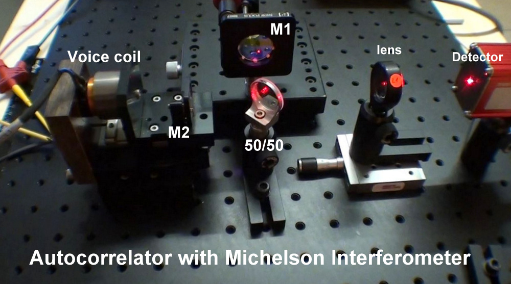
<video id="video" controls="ture" preload="none" poster="./sources/laser/autocor1m6.jpg" width="75%" x5-video-player-type="h5" >
<source id="mp4" src="./sources/laser/video/voice coil autocorrelator for femtosecond pulses analysis.mp4" type="video/mp4">
</video>
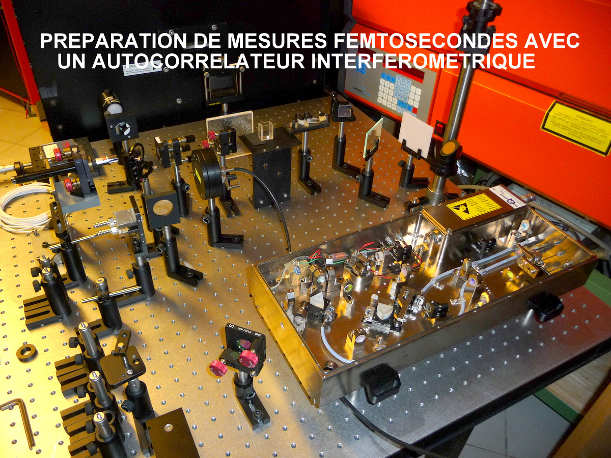 
- <a href="./sources/laser/video/Principle of interferometric autocorrelation.mp4" target="_blank">干涉自相关</a>   
组成包括：一个Michelson干涉和光电二极管。  
&nbsp;&nbsp; 装配中，设置为800nm的Titanium：Sapphire MIRA900可调激光器提供120fs FWHM的光脉冲。
脉冲进入干涉仪，由50:50的分隔板将其分成强度相等的两个脉冲。
一个脉冲被固定的三棱镜反射，另一个脉冲也被相同类型的反射镜反射，但是这是可移动的，通过音圈沿光路来回移动频率约为几十赫兹。  &nbsp;&nbsp;
因此，这使得有可能在通过分离器的重组期间任意地相对于另一个脉冲来时移。
另外，如在图中可以看到的，这种重组是共线发生的，这两个场的总和因此产生了干扰现象。
然后，将所得的场发送到光电二极管，该光电二极管将其转换为电信号。
该电信号是光电二极管内非线性转换过程的结果，可以通过说自相关信号S（tau）等于自相关信号S（tau）来数学表示。
当我们将信号S（tau）绘制为tau的函数时，如果我们事先知道包络线的形状，则可以得到一个图形（见图片），
该包络线的中间高度允许从激光脉冲中减去后者的中途持续时间（FWHM），因此可以相当精确地估算激光脉冲的持续时间。 
 
- 双光子吸收TPA  
[Goppert-Mayer](http://myweb.rz.uni-augsburg.de/~eckern/adp/history/historic-papers/2009_521_466-479.pdf)  
   
为了使2光子吸收在半导体的导带中生成电子，两个光子的能量之和必须大于半导体禁带的能隙，两个光子之一的能量必须至少等于带隙能量的一半。  &nbsp;&nbsp; 
THORLABS提供的DET25K检测器用于制造二阶干涉式自相关器所需的组件，该检测器包含一个GaP二极管，
其接收表面为4.8mm2，容量为1000pF @ 0V，上升时间为1ns，下降时间为140ns @ 5V ...  
&nbsp;&nbsp; DET25K装有FELH0700干涉滤光片，该滤光片可阻挡150nm至700nm之间的光，FGAP71二极管的灵敏度位于该区域。 
因此只有800nm的脉冲将通过干涉滤光片，然后将通过GaP光电二极管上具有大数字孔径的显微镜物镜进行聚焦。
在800nm处吸收2个光子的禁带能量位于400nm（3.2 eV），灵敏度为0.11A/W。 
使用该二极管，还必须能够在600nm至1050nm之间的2光子吸收率下工作。   
&nbsp;&nbsp; 干涉式自相关仪由两部分组成：  
MICHELSON干涉仪，它可以使要分析的波与参考波发生干涉，
为此，我们将一个反射镜移动一个距离Lm1，该距离Lm1取决于要分析的激光脉冲的持续时间。
对于1ps的脉冲，此距离为150微米；对于1ns的脉冲（1000ps），该距离为15cm。
为了进行这些测量，我在移动光学平台上制作了一个测量工作台，可以将其移动到要测量的激光旁边。   
第二部分是通过GaP半导体中的双光子吸收来检测干涉信号。  
&nbsp;&nbsp; 第一个系列的测量中，我们使用“语音线圈”来激活球形滑轨上的镜子支撑。  
&nbsp;&nbsp; 第二系列的测量将通过在其杆上装有后向反射镜（三棱镜）的“语音线圈”进行。  
&nbsp;&nbsp; 第三系列的测量将通过将镜粘贴至所使用的压电传感器（PbTiO 3）测量飞秒脉冲10fs L m1 = 1.5微米！
处于吸收模式的探测器具有2个光子，其分辨率低于飞秒！  
&nbsp;&nbsp; 第四个系列的测量将使用安装在带有步进电机的150mm转轮上的镜子进行，该步进电机将测量10fs和1ns 之间的脉冲。  

第一系列|配有平面镜松紧带的“语音线圈”测量
--|:--:
带有线圈并装有平面镜的音圈：|干涉环的图像：
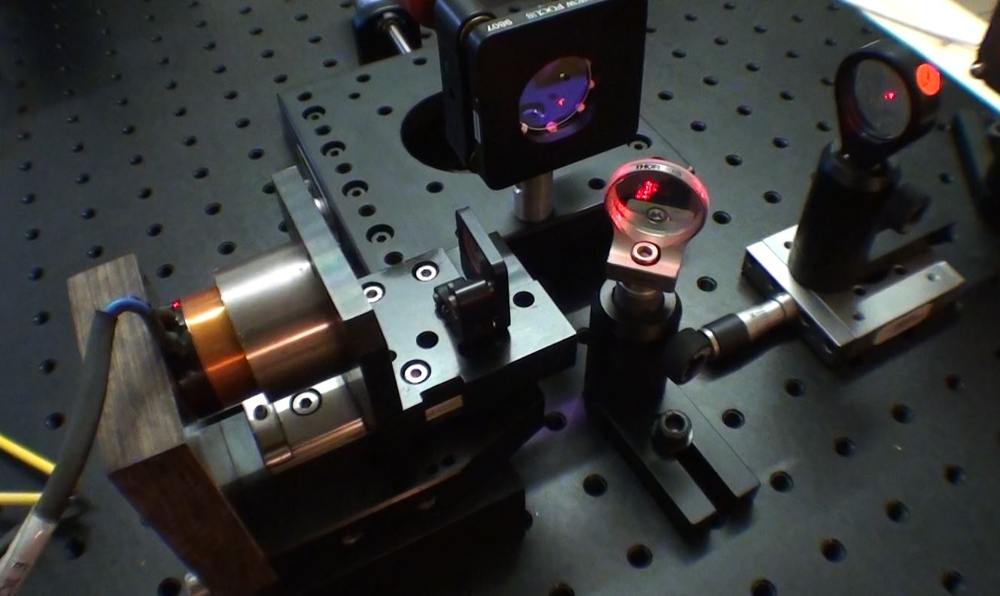|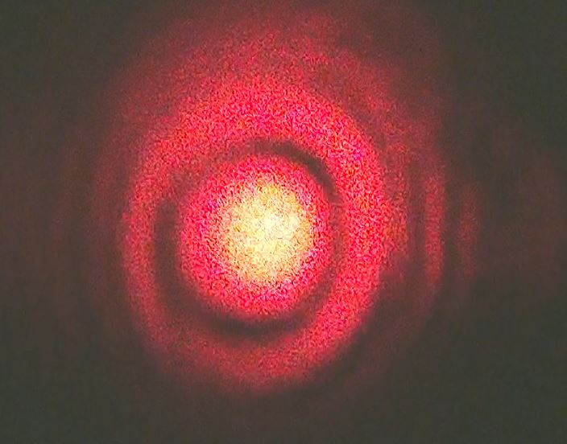
光电二极管传递时间电信号：|光电二极管信号与镜面位移的关系：
|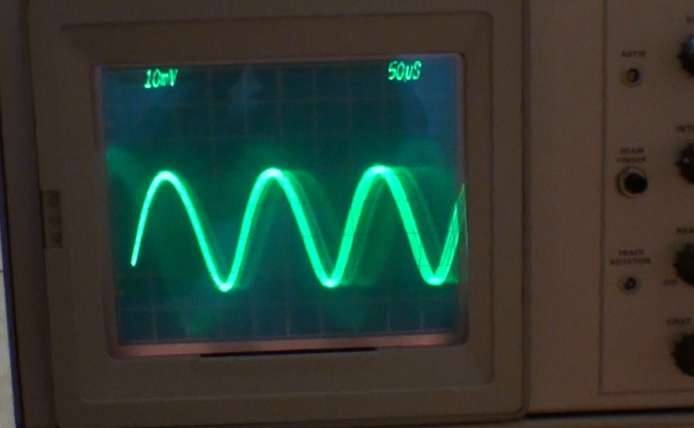
音圈为300Hz：|音圈为1kHz：
|
第二系列|三棱镜的“语音线圈”测量
|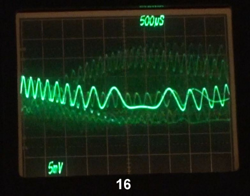
第三测量系列|使用测微螺杆和扩束器进行手动位移
说明：|可移动镜子安装在配有测微螺钉的精密滑块上，该螺钉允许手动移动其中一个镜子。
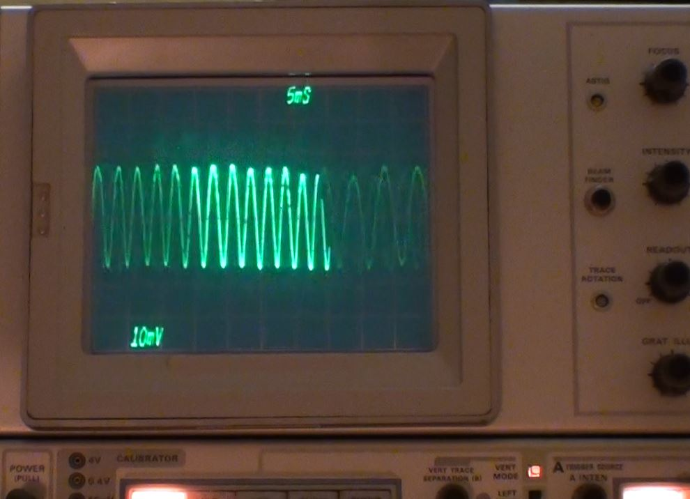|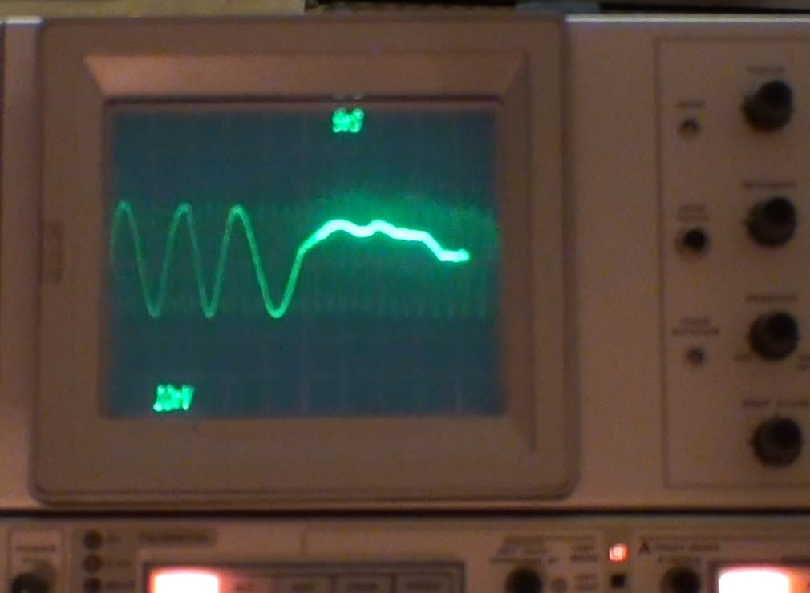
第四测量系列|PbTiO 3压电双压电晶片执行器
说明：|使用PZT中的双压电晶片刀片，仅在一侧上滴一滴硅酮胶，并根据下图将直径为6mm的镀铝镜粘合在双压电晶片的中间：
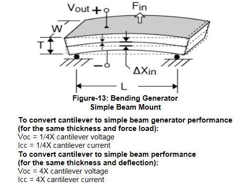|
信号分析：|发生器以1250 Hz的频率提供20伏的正弦信号，双压电晶片PZT跟随该信号，并产生30°量级的轻微相移。
光电二极管上接收到的干扰信号为50mV。每个正弦波都对应于源激光器的波长，此处的HeNe激光器为623.8nm。一个周期内有13个正弦曲线，距离为8.2微米！|三角形和正方形信号。双压电晶片的主要问题是共振，这意味着它们不适用于某些频率。
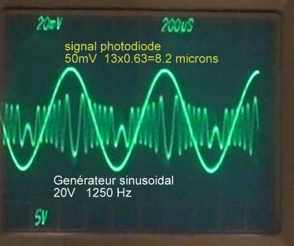

视频：

<video id="video" controls="ture" preload="none" poster="./sources/laser/bimorphe15.jpg" width="50%" x5-video-player-type="h5" >
<source id="mp4" src="./sources/laser/video/PZT driver with double shape sheet for Michelson interferometer.mp4" type="video/mp4">
</video>
<video id="video" controls="ture" preload="none" poster="./sources/laser/bimorphe17.jpg" width="50%" x5-video-player-type="h5" >
<source id="mp4" src="./sources/laser/video/Michelson manual moving interferometer.mp4" type="video/mp4">
</video>
<video id="video" controls="ture" preload="none" poster="./sources/laser/Measurement of laser pulse width by interferometer.jpg" width="50%" x5-video-player-type="h5" >
<source id="mp4" src="./sources/laser/video/Measurement of laser pulse width by interferometer.mp4" type="video/mp4">
</video>

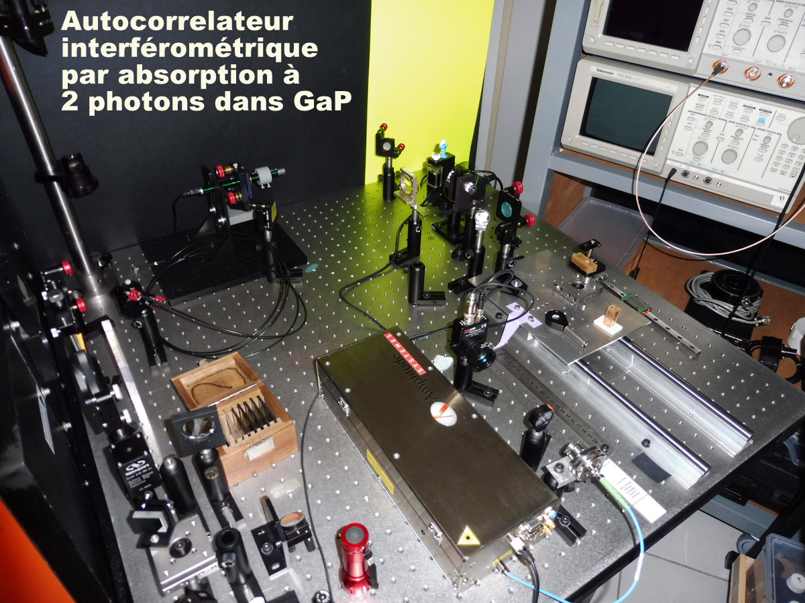    

- 光子自相关  
双光子荧光自相关 

  
- <a href="./sources/laser/video/Principle of intensimetric autocorrelation.mp4" target="_blank">强度自相关</a>   
通过磷光跃迁进行强度自相关，在示波器上，半高持续时间为470ps！
能够使用在第二域中具有响应时间的检测器来确定皮秒级的激光脉冲持续时间！  
<video id="video" controls="ture" preload="none" poster="./sources/laser/autocor1.jpg" width="75%" x5-video-player-type="h5" >
<source id="mp4" src="./sources/laser/video/Autocorrelation phosphorescence.mp4" type="video/mp4">
</video>

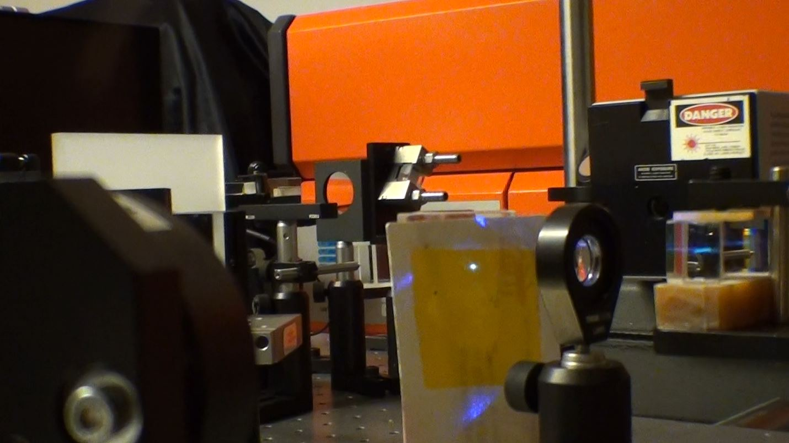

  
MOPALITE MOPA-600激光在500皮秒内产生600kW的脉冲。光束被分成2个强度相同的反向传播光束（每个光束300kW）。
两个棱镜返回2条光束，这些光束叠加在包含能够发磷光物质的塑料屏幕上。  

---

## 超快激光

**Ultrafast solid-state lasers** ：<a href="./sources/laser/list/pdf/ultrafastsslasers.pdf" target="_blank">pdf </a> 
**Laser Pulsing Techniques** ：<a href="./sources/laser/list/pdf/pulse_compression.pdf" target="_blank">pdf </a> 

- 飞秒绿光   
在5x5mmx1.6mm厚的KTP晶体中进行倍频测试，对于70至100fs的脉冲持续时间，倍频晶体的理想厚度应为30微米。
ORIGAMI-10：214MHz（112mW）、5nJ。   
<video id="video" controls="ture" preload="none" poster="./sources/laser/ktporigamim10.jpg" width="75%" x5-video-player-type="h5" >
<source id="mp4" src="./sources/laser/video/Green femtosecond pulses.mp4" type="video/mp4">
</video>   
- 1.6ps锁模激光二极管   
<video id="video" controls="ture" preload="none" poster="./sources/laser/1.6 picosecond pulses.jpg" width="75%" x5-video-player-type="h5" >
<source id="mp4" src="./sources/laser/video/Modelocked laser diode.mp4" type="video/mp4">
</video>  
- 飞秒激光和光学组件DIY   
<video id="video" controls="ture" preload="none" poster="./sources/laser/Femtosecond Laser Lab.jpg" width="75%" x5-video-player-type="h5" >
<source id="mp4" src="./sources/laser/video/Femtosecond Laser Lab.mp4" type="video/mp4">
</video>
<video id="video" controls="ture" preload="none" poster="./sources/laser/Optical Components.jpg" width="75%" x5-video-player-type="h5" >
<source id="mp4" src="./sources/laser/video/Optical Components.mp4" type="video/mp4">
</video>   
- Kerr效应   
  
KERR DC效应是通过在具有显着二阶折射率的绝缘液体（例如硝基苯，硫化碳）中的两个板之间施加高电压脉冲（几千伏）而产生的，其响应时间为ms到ns域。
KERR AC效应是通过在液体或固体中发出非常强烈的红外脉冲而获得的，响应时间小于飞秒！   

- **激光脉冲压缩**   
光子晶体光纤 两种：实心光纤和中空光纤，这取决于注入的能量和所需的持续时间。 &nbsp;&nbsp;
皮秒和飞秒脉冲的压缩发生在光纤的纤芯中，该光纤的芯由玻璃或石英制成，用于kW域中的瞬时功率！
由于穿过光纤的高光强度所产生的非线性折射率n2的变化，这种压缩通过光谱展宽而发生。使用这种光纤来产生白光而无需使用压缩镜。
如果使用啁啾镜，将重新压缩脉冲。再压缩系数取决于光纤输入端的脉冲持续时间，激光脉冲的波长和光纤的长度。 &nbsp;&nbsp; 
不同的物理现象来自于衍射，群速度的分散，克尔效应引起的自聚焦，脉冲的自增强，时空聚焦，拉曼散射，电离，等离子体的散焦以及光吸收和重组。  

  
<a href="./sources/laser/pdf/Benabid.pdf" target="_blank">中空光子晶体光纤</a>  
 &nbsp;&nbsp;
中空纤维中（充满刚性或柔性空气）的压缩是通过自相位调制发生的，
这是气体中非线性折射率n2改变的结果（约比纤芯小1000倍）。
为了补偿这种不利的情况，在限制为一米量级的实际长度，将峰值功率从KW增加到GW（100万倍）。
经过大约一米的行程后，可获得10至20的压缩系数。在这种情况下，必须通过啁啾镜压缩脉冲。 &nbsp;&nbsp; 
刚性中空纤维充满稀有气体（He； Ar； Ne； Kr； Xe）的情况，稀有气体的直径约为波长的250倍（多模态），
长度为3米HISOL John.C.从10飞秒的脉冲“没有obtained的再压缩镜”开始可以获得400阿秒的脉冲。 &nbsp;&nbsp; 
在纤维中形成高能孤子，并在其中填充有稀有气体的空心毛细管会导致在光纤中传播的光脉冲的时间和光谱形式发生极大变化。
孤子是传播而不会变形的电磁脉冲。从本质上讲，它是传播方程在所穿过的介质中的稳定解，孤子是由两个相互补偿的效应之间的平衡产生的。
在光孤子的情况下，这些影响本质上是自动相位调制和异常色散。 &nbsp;&nbsp; 
自相位调制将脉冲的前移移到最低频率（因此是最长的波长），并将脉冲的滞后移向短波长。
异常色散将高频移向脉冲的前部，而低频则向后移动（与正常色散的情况不同，红色在这里的传播速度不及蓝色快）。 
两种情况：  
A. 小于1mJ的能量  &nbsp;&nbsp; 
在光纤中，仅产生相位自调制，这导致对称光谱展宽以获得压缩的脉冲；必须使用“啁啾”镜。  
B. 较高的能量在1mJ处  &nbsp;&nbsp; 
产生包含在光纤通道中的气体的相位自动调制+电离（异常色散），这将产生更宽的光谱，从而向蓝色偏移，因此不对称。
结果，将具有较高的压缩率，因此脉冲持续时间较短。对于高于1mJ的能量，使用圆极化以提高效率。并在高能孤子状态下工作。
 

  
从CLARK MXR2010激光器产生一个单周期激光脉冲，分三个阶段进行压缩：  
在PYREX玻璃管中以760托的氩气丝化进行第一次压缩。  
&nbsp;&nbsp; 为此，使用反向望远镜将光束的直径减小了3倍，以避免聚焦透镜在焦点上产生过高的强度，而强度过强并会破坏灯丝。
L2石英镜片经过AR 800nm处理，焦距为1米。
PYREX管的内径为50毫米，长度为1600毫米，在布鲁斯特角有2个硅胶窗，厚度为0.5毫米。
在管子的出口，发散光束由焦距为1 m的凹面镜平行，并在775nm处有多层介电涂层，其R值为99.95％。
通过输出镜后，希望能以0.5mJ的能量获得30fs的脉冲。  
在直径为20毫米，直径为32毫米的PYREX玻璃管中使用直径250微米，长600毫米的中空石英纤维进行第二次压缩。  
&nbsp;&nbsp; L3透镜将光束导向250微米的中空纤维。管内的氖气压力为4000托。
考虑的另一种可能性是使用具有19个细胞HCPCF-19的下摆线型KAGOME纤维。
使用两个具有BRAGG网络且具有VOLUME TRANSMISSION的全息镜，通过压缩。
在这个水平上，将有一个6fs和0.2mJ的脉冲。 
第三次压缩使用厚度为0.5毫米的二氧化硅叶片。 
&nbsp;&nbsp; 一个内径为50毫米的玻璃外壳，带有4个0.5毫米厚的二氧化硅刀片，位于光学焦点附近，每个刀片之间的间隔约为8厘米。
焦距为600毫米的M5银镜将光束聚焦在叶片上。
焦距为600 mm的M4反射镜将光束变直使其平行，然后将其发送到最后一对啁啾反射镜，以形成2.5fs的单周期光脉冲！ 
 &nbsp;&nbsp; 
由于非线性相互作用（例如光学克尔效应或带有结构芯的稀有气体填充的中空纤维中的电离），激光脉冲的光谱变宽。
这些“ KAGOME HC-PCF”型中空纤维的输出脉冲可以具有足够宽的频谱以产生一个单周期脉冲。
但是，在非线性光学介质中传播期间会形成复杂的相结构。仅当使用啁啾镜补偿二阶色散时，才能将激光脉冲压缩到几个周期的极限。
如果要压缩更多，则必须使用高阶啁啾镜补偿三阶和更高阶的色散。 &nbsp;&nbsp; 
在第三次压缩中，将使用SiO2或CaF2玻片进行光谱加宽。为避免Kerr聚焦在刀片中，在真空管中使用了以布鲁斯特角定向的0.5mm厚刀片。
刀片将放置在焦距为200mm的银色凹面镜焦点附近。 
  
待续...

- **下一章**   

---
## [激光器图解](lasers.md)
---
## Development
**Introduction to development**  

- **需求评估**  
&nbsp;&nbsp; 第一步是仔细评估确切需要什么。在此阶段必须实现所有要求，因为在稍后的阶段引入的其他特性可能会更加昂贵。
要么采取昂贵的附加措施，要么在稍后阶段改变技术方法。  

- **技术适用性**  
&nbsp;&nbsp; 第二步是检查所设想的技术是否总体上合适，也许将所选择的方法与竞争方案进行比较。
此步骤至关重要，因为在此阶段犯的错误会影响整个开发过程。  
&nbsp;&nbsp; 各种技术都有特定的优点和局限性，其相关性在很大程度上取决于具体情况。  

- **制定原型设计**  
&nbsp;&nbsp; 下一步是制定详细的设计，可用于构建原型。该过程涉及在开始任何实验室工作之前对各种问题进行定量检查。  
&nbsp;&nbsp; 例如，如果开发了被动锁模固体激光器，则该过程可以包括有关泵浦强度和激光增益（在不同波长下），
[阈值泵浦功率](https://www.rp-photonics.com/threshold_pump_power.html)，
[色散](https://www.rp-photonics.com/chromatic_dispersion.html)和
[非线性](https://www.rp-photonics.com/nonlinearities.html)
平衡的计算（不一定是详细的[建模](https://www.rp-photonics.com/laser_modeling.html)）在
[谐振腔](https://www.rp-photonics.com/laser_resonators.html)
中，期望的
[对准灵敏度](https://www.rp-photonics.com/alignment_sensitivity_of_optical_resonators.html)，
[SESAM](https://www.rp-photonics.com/semiconductor_saturable_absorber_mirrors.html)
所需的
[调制深度](https://www.rp-photonics.com/modulation_depth.html)，
SESAM的整体工作点（与饱和度有关），脉冲整形强度等。  
&nbsp;&nbsp; 这样的计算远远超出了使用简单计算器可以完成的计算。通常将需要激光建模软件。
可以在很早的阶段识别出各种问题，然后进行设计更改，直到获得的设计中没有许多可预见的问题。  
&nbsp;&nbsp; 设计阶段的“交付成果”是一份清晰书面的设计报告，不仅包含建议原型的所有参数，
而且还清晰描述了设计背后的原因以及可能存在的局限性，一些警告和所需零件清单等。  
&nbsp;&nbsp; 开发项目的有效性，速度和成本在很大程度上取决于结构良好的过程。
至关重要的一点是一开始就进行固体激光器设计，这不仅是对已经很严重的问题的反应。
因此，设计不是复杂的开发过程的结果，而是其基础，以及下一个项目的宝贵投入。  

- **建立和测试原型**  
&nbsp;&nbsp; 设计出原型设计，就可以订购所需零件，并按照设计中的详细规定来制造原型。
显然，如果没有适当的原型设计，则开始该阶段的效率很低，例如，因为随后可能需要在实验室测试阶段订购额外的组件（导致额外的成本和延误），
并且由于各种类型的问题会更加困难且确定和解决的成本很高。实验室测试通常是开发中最昂贵，最耗时的过程。  
&nbsp;&nbsp; 原型可能仍然会出现一些无法预料的问题–当然取决于设计阶段所采用的谨慎程度和经验。
在确定问题的根源并为他们找到合适的解决方案后，将对其进行相应的修改。  
&nbsp;&nbsp; 根据试验和错误程序中的实验测试，通过进一步的更改来优化设计通常非常耗时。
例如，重新布置激光装置通常需要完全重新对准，并且如果更改被证明是有误的，则同样适用于重建原始设计。
此外，实验结果通常不是结论性的，甚至是误导性的，因为测量的性能值可能受到控制不当的影响，例如不理想的对准，脏污的组件或温度变化。  

- **完成产品设计**  
&nbsp;&nbsp; 由于各种原因，通常必须采取进一步的步骤才能将原型设计转变为最终产品设计：
> - 有时，性能需求会在开发阶段发生变化，或者只有在那时才发现其他需求。  
> - 可能会发现，对于最终产品，某些公差（例如，关于未对准的公差）仍然过于严格。  
> - 通常，工业上的设计必须比原型具有更严格的要求，
在有效生产，对实际应用直到严苛条件下具有足够的鲁棒性等方面，以及对客户的整体便利性方面。  
> - 人们可能希望通过使用更少或更便宜的组件来最大程度地降低生产成本。  

评估各种设计变更的详细效果，进行实验测试，这通常会更耗时且结论性较低。  
&nbsp;&nbsp; 将设计文档视为开发过程的副产品，而不是其基础。
这很容易导致实验室中无效的迭代步骤，与在较早阶段进行详细设计的过程相比，这可能消耗更多的时间和资源。  

- **用户手册**  
&nbsp;&nbsp; 除设计文档外，还可以在所有原型测试和完善之后编写用户手册。在这里，拥有该设备的所有实践经验已经是一个优势。
但是，重要的是，手册的作者必须能够充分认识最终用户的需求，这些最终用户对设备的技术细节了解较少。  
---

- **应用：激光设计**  

- 定义设计目标：   
在进行设计之前，必须仔细评估设计目标。这些不仅应包括诸如输出功率和波长之类的中心性能参数；还有更多细节可能是相关的：  
> - 最佳性能，例如在输出功率，
[功率效率](https://www.rp-photonics.com/wall_plug_efficiency.html)，
[光束质量](https://www.rp-photonics.com/beam_quality.html)，
[亮度](https://www.rp-photonics.aom/brightness.html)，
[强度噪声](https://www.rp-photonics.com/intensity_noise.html)/
[相位噪声](https://www.rp-photonics.com/phase_noise.html)，长期稳定性（输出功率或光频率），
[时序抖动](https://www.rp-photonics.com/timing_jitter.html)等方面；  
> - 紧凑，方便的设置，易于操作（例如，简单的开机程序，简单的
[波长调谐](https://www.rp-photonics.com/wavelength_tuning.html)，无需重新
[对准](https://www.rp-photonics.com/alignment_sensitivity_of_optical_resonators.html)）；  
> - 最大的灵活性（例如用于更改操作参数）；  
> - 可靠性，低维护要求，简单且经济高效的错误分析，维护和维修；  
> - 对振动，温度变化，电磁干扰，组件老化的敏感性最小；  
> - 生产成本低，即零件数量少，对准和测试简单，避免使用昂贵，敏感或难以获得的零件。  

当然，建议在投入大量资源进行激光开发之前，针对特定情况仔细制定这些要求的清单，
因为将其他特性引入到现有设备中可能会变得更加昂贵和耗时。  

- 激光设计的重要方面：  
所设计的激光设备的性能很大程度上取决于设计细节，而不仅取决于所使用的零件。一些方面特别重要：  
> - 一般设计参数，例如谐振腔长度（影响紧凑性，调谐问题，频率稳定性等），泵浦强度；  
> - 选择增益介质（例如一个
[激光晶体](https://www.rp-photonics.com/laser_crystals.html)）和泵浦源，几何的适当选择（例如，杆或
[薄盘](https://www.rp-photonics.com/thin_disk_lasers.html)，
[侧泵](https://www.rp-photonics.com/side_pumping.html)或
[端泵](https://www.rp-photonics.com/end_pumping.html)），
[掺杂浓度](https://www.rp-photonics.com/doping_concentration.html)，晶体长度等；  
> - 泵浦设置（例如，用于二极管泵浦激光器），影响输出功率和光束质量，长期稳定性以及泵浦二极管的更换简便性；  
> - 最佳的激光谐振腔类型（例如，线性或
[环形激光器](https://www.rp-photonics.com/ring_lasers.html)，具有单片或离散元件）和优化的
[谐振腔设计](https://www.rp-photonics.com/resonator_design.html)，影响零件数量，输出功率和光束质量，对准公差，热透镜灵敏度，机械等方面稳定性和漂移；  
> - 选择和放置激光
[反射镜](https://www.rp-photonics.com/laser_mirrors.html)和腔内组件，以进行波长调谐，通过
[锁模](https://www.rp-photonics.com/mode_locking.html)产生短脉冲，
[色散补偿](https://www.rp-photonics.com/dispersion_compensation.html)，频率稳定等；  
> - 机械外壳，影响机械稳定性，冷却效率，温度漂移，易于维护以及
[安全问题](https://www.rp-photonics.com/laser_safety.html)；  
> - 电子设备，例如用于
[稳定输出功率](https://www.rp-photonics.com/stabilization_of_lasers.html)，控制激光波长，监视泵浦二极管的状态或温度，确保安全操作的电子设备；  
> - 适当的文档，包括零件清单（可能与供应商一起使用），机械设计，对中和测试程序，设计思想，可能的可选扩展和修改操作参数的限制；  
> - 其他...  

简而言之，激光产品的设计细节可能对其性能，可靠性，灵活性和制造成本产生重大影响。
对于高效的开发过程，这至关重要：  
> - 了解所有设计目标   
> - 知道达到它们所需的设计属性   
> - 并使用适当的激光设计（一开始就解决了）   

- 设计激光器需要什么：  
设计激光器是一项艰巨的任务，需要以下内容：  
> - 对需求的详细了解，其中可能包括对应用程序的一些了解；   
> - 详细了解所有相关物理效应，例如激光放大，
[热透镜](https://www.rp-photonics.com/thermal_lensing.html)，
[谐振腔模式](https://www.rp-photonics.com/resonator_modes.html)，[激光噪声](https://www.rp-photonics.com/laser_noise.html)等，以及它们之间的相互作用；   
> - 基本数据，例如[激光晶体的数据](https://www.rp-photonics.com/laser_crystals.html)；   
> - 在不丢失重要细节的情况下将复杂性降低到实际水平的能力；   
> - 灵活的计算和模拟软件；   
> - 激光方面的实践经验，使人们能够识别典型问题，正确解释实验观察结果等。   

- 设计在开发项目中的作用：  
通常不建议将激光设计作为开发过程的结果，该开发过程主要基于试错法。设计只是次要的，只是总结了一个漫长过程的结果。
在这种情况下，设计通常甚至没有得到适当的记录，这会造成丢失大量潜在有价值信息的风险，而此时仅节省了少量时间。  
建议在激光设计中起至关重要的作用：  
> - 激光设计可以正确处理所有可能或相关的已知问题。尽管此过程比实验室中的反复试验方法更快，更便宜，但它需要花费大量时间，当然还需要全面的专业知识。  
> - 适当的设计不仅是一套构想，而且是一个非常具体的描述，例如包括所需零件清单，关于如何将它们组合在一起的或多或少的详细说明，在不那么琐碎的地方，并且最好在描述后进行补充基本推理，关于限制的讨论等。  
> - 然后根据设计制造原型，反之亦然。这大大加快了制造速度，从而有效利用了昂贵的实验室资源。  

尝试简化过程会带来由于未预期的技术问题而导致降低的性能值和较大的时间延迟的风险。  

- 从较旧的设计派生设计：  
在工业开发中，通常是从较旧的设计中衍生出一些产品设计，而不是从头开始。尽管这看起来非常经济，但是仍然存在很大的风险，
尤其是在没有按照上述方法正确设计和记录第一个设计的情况下。  
一个主要的挑战是，修改激光器设计的某些细节可能很容易产生意想不到的副作用，从而引入了新的问题，进而需要采取额外的措施，而这些问题又会产生副作用。 
- 设计审查：  
当发生重大问题时，或者当需求增加并且可以通过修改后的设计（而不是全新的设计）来满足时，可能就是这种情况。
如果尚无适当记录的设计，则该进行此工作的时候到了；此过程可能已经提供了有关需要改进的重要提示。  

- **谐振腔设计**  

在简单情况下，谐振腔的基本设计从一开始就是明确的（例如：两个镜面谐振腔），并且只需要调整某些设计参数，例如镜面曲率半径或元件之间的距离。
在其他情况下，还必须决定主要的谐振腔架构，例如：  
> - 应该是线性谐振腔还是环形谐振腔？  
> - 应的激光晶体放置在靠近一个端镜，或两个聚焦镜之间更好某处？  
> - 应该在哪里一个波长调谐元件或可饱和吸收体被置于？  
> - 将弯曲的折叠镜插入某处是否有帮助？  

  
在设计过程开始时，并非总是能够回答此类问题。人们可能从某种谐振腔架构开始，但后来在意识到某些基本局限性时必须对其进行更改。  

- 重要的谐振腔特性  
谐振腔设计目标可能包括很多方面，这些方面会影响各种性能细节：  
> - 经常遇到的要求是在某些光学组件中或在某些光学组件（例如增益介质（在激光谐振腔中），可饱和吸收体（在锁模激光器中）或反射镜）中具有合适的模式尺寸。  
> - 在许多情况下，重要的是要避免模式尺寸对机械公差（长度偏差或未对准）和热透镜效应（包括光学像差）过分敏感。对于激光器，这有利于在很宽的泵浦功率范围内获得良好的光束质量。  
> - 增益介质中相对于热透镜的光焦度的稳定区应尽可能宽，与最小模式尺寸有关。  
> - 谐振腔应具有适当的长度，例如用于通过调Q短脉冲或易于单频操作的长度，或用于锁模激光器合适脉冲重复频率的特定长度。
在某些情况下，谐振腔需要具有在可变长度下工作的潜力，如用于获得重复率可调的脉冲。  
> - 在许多情况下，例如对于低阈值泵浦功率和低激光噪声，应将往返损耗降到最低。  
> - 经常需要最少数量的光学组件。  
> - 可以优化整体尺寸，还可以优化机械稳定性和易于制造。  

在某些情况下，使用优化的谐振腔可以显着提高激光器的性能，并大大降低对准灵敏度。  

- 谐振腔模式的作用  
大多数重要的谐振腔特性是模式的特性。因此，谐振腔设计过程通常以两个不同的步骤完成：  
> - 首先，需要确定哪些模式属性对于性能至关重要，以及应该具有哪些值。  
> - 此后，人们可以尝试找到一种具有具有这些特性的模式的谐振腔设计。  

第一步通常应基于一些激光物理计算。例如，可能必须针对光强度与增益介质的饱和强度的适当比率设计谐振腔。  
第二步，通常需要一些数字谐振腔设计软件。  
- 一个简单的例子是端泵浦连续固态激光器  
它要求具有高（衍射极限）光束质量。
这里，**模式半径在激光晶体应大致匹配泵浦光束半径**，因为这导致优化的能量转换效率及抑制高阶横模，
与基本（高斯）模式相比，由于其较低的空间重叠，其增益较低。  
> **应根据所需的激光阈值计算出合适的泵浦半径和激光束半径。**  
&nbsp;&nbsp; 通常应选择泵浦光束半径和模式半径，以使在达到预期的泵浦功率水平时，激光器将在高于激光器阈值的情况下工作几次。
对于四级增益介质，这意味着腔内激光强度应为激光增益饱和强度的几倍。
（对于准三级增益介质，计算要困难一些。）然后需要一定质量的泵浦光束，以保证在晶体中适当的泵浦光束半径。  
> **通常会避免在谐振腔稳定区边缘附近操作。**  
&nbsp;&nbsp; 模式半径通常取决于热透镜的强度。因此，特别是对于高功率激光器，有必要估算热透镜的强度（光焦度），并设计谐振腔，使其在该值的特定范围内工作。 
&nbsp;&nbsp; 例如，激光晶体内和激光输出处的模式半径不应有太大变化，并且模式半径不应变小到足以导致光学损伤或其他与过度的光学强度有关的问题。
通常可以通过设计谐振腔来实现这一点，以便对于热透镜的预期光焦度，可以在稳定区内正常工作，即不靠近稳定区域的边缘，在该区域中，模式半径可以发散或接近零。 
> **不要忽视对准灵敏度的问题！**  
&nbsp;&nbsp; 在激光晶体中具有类似模式半径的谐振腔设计在对准灵敏度方面可能有很大差异，这会使某些设计在实践中很难使用。
注意，对准灵敏度在线性谐振腔的两个稳定区域的四个边缘之一处发散。  
> **有时，最好牺牲光束质量以获得更宽的稳定性范围和更低的对准灵敏度** 
&nbsp;&nbsp; 相对于热透镜，稳定区的宽度与最小模半径成反比，这表明对于需要大模的高功率激光器存在问题。而且，对准灵敏度通常将更高。
因此，有时会设计一种谐振腔，使其模式大为减小，从而使稳定范围更宽，对准更不敏感，尽管这会牺牲光束质量，
这样，激光晶体中的整个泵浦区域就只能被横向模式的某种组合所覆盖。（然后可以从泵浦面积与基本谐振腔模式面积之比中估算出最终的光束质量。） 
&nbsp;&nbsp;这种多模激光器实现的功率转换效率通常比采用单横向工作模式的谐振腔要高一些，这主要是因为激光器的强度曲线可以更灵活地将自身调整为可用的增益。 

- 脉冲激光器的其他限制  
&nbsp;&nbsp;在有源调Q激光器中，需要某种光学调制器。因此，谐振腔设计需要为此提供一定的空间，并且在该位置应具有适当的模半径，
这样一来，就不会在调制器的孔径处截断光束，而不会太强地聚焦光束，这可能导致损伤。  
&nbsp;&nbsp;类似地，无源Q开关（可饱和吸收体）必须以适当的光束半径进行操作，以便获得适当程度的吸收器饱和度。
否则，吸收器可能会损坏或导致过多的功率损耗。  
&nbsp;&nbsp;类似的考虑也适用于被动锁模激光器。另一个方面是，如果吸收器饱和度太弱，则可能会获得Q开关不稳定性。还要注意，稳定的单横向模式操作是锁模的重要条件，因此正确的模式尺寸尤为重要。
另一个问题可能是色散补偿，为此可能需要在设计中集成一个棱镜对或一些色散镜。  
&nbsp;&nbsp;谐振腔的总长度（决定谐振腔中光的往返时间）也是脉冲激光器中的重要数字。
对于调Q激光器，它对获得的脉冲持续时间有重要影响，而在锁模的情况下，它决定了脉冲重复率。  

- 腔内倍频   
&nbsp;&nbsp;在腔内倍频的情况下，谐振腔当然必须为非线性晶体提供一定的空间和适当的光束半径，以便获得合理数量的单程转换（例如百分之几）。
此外，还需要在适当的位置耦合出倍频的光-最好获得单个输出光束，
同时利用两个方向上的非线性转换。通常选择在折叠镜而不是端镜处进行输出耦合。  

- 横向模式频率   
&nbsp;&nbsp;在某些情况下，还应考虑横模的光学频率。例如，当无法保证与基本模式的完美模式匹配时，这对于用作频率滤波器的无源谐振腔可能至关重要。
在某些情况下，必须通过确保那些根据空间模态性质可能基本耦合的模式具有与基本频率不同的光频率来避免激光谐振腔中的模式耦合至高阶模式。  

- 典型权衡   
&nbsp;&nbsp;通常不可能理想地满足对谐振腔设计的所有要求，因为存在某些基本限制，或者在设计中没有足够的自由参数。
因此，谐振腔的优化可能涉及各种折衷：  
> - 就光束质量或对准灵敏度而言，特别紧凑的谐振腔设计可能不是理想的。  
> - 在稳定区  I中操作会大大降低对准灵敏度，但是这可能需要更长的谐振腔或谐振腔反射镜上的光斑尺寸更小，例如在调Q激光器的情况下，这可能会引起问题。  
> - 可以将高功率激光器设计为具有衍射极限的光束质量，但是对未对准的公差较低。  

成功的优化只有在对特定要求，相关物理效果以及所涉及的取舍有深刻了解的基础上才有可能。  

- 设计问题   

> **找到一个好的设计通常比分析一个设计困难得多。**  
&nbsp;&nbsp;尽管通常很难评估给定谐振腔的模态特性，但要找到具有所需模态特性的谐振腔设计可能更具挑战性，尤其是在必须同时满足多个条件的情况下。
还应注意，任何旨在改善一种谐振腔性能的设计更改，可能同时也影响所有其他性能。
因此，谐振腔设计过程通常无法正常工作，以至于无法逐步解决不同的问题。
通常，仅一步一步地解决各种问题的过程中的激光设计容易耗时且效率低下。  
> **可以使用初步测试谐振腔，例如以精确地测量热透镜的强度。**  
&nbsp;&nbsp;在某些情况下，可能需要首先设计和构造一个测试谐振腔，以便在实现实际的激光谐振腔以获得最佳性能之前，可以精确地测量热透镜的强度。
有用的测试谐振腔可以例如具有良好定义的稳定性边缘，其中例如当达到一定的光焦度时，模式半径迅速（而不是逐渐地）上升。  
&nbsp;&nbsp;一种有效的谐振腔设计数值方法是定义品质因数，将其作为所有非理想特性的“判定”之和，并通过改变谐振腔臂的长度和可能的镜面曲率，使用数值技术将其最小化。
由于品质因数通常具有大量的局部极值，因此有时会使用蒙特卡洛方法来寻找全局最优值或至少找到一个好的解决方案。  

- **速率方程求解**  

**示例：掺Er增益介质的速率方程**   
在掺铒光纤放大器中使用的掺铒光纤，在1.5μm光谱范围内工作的放大器和激光器表现出准三级系统。  
  
对于这种情况，获得的速率方程系统如下：  
  
在光纤放大器中发生放大的自发发射（ASE），则可能会涉及其他光波长。
在数值模型中，ASE 光谱分为离散的波长，每个波长与吸收和发射横截面的不同值关联。  
对于增益介质中的给定位置和给定的光强度，可以通过速率方程的时间积分来计算区域密度的时间演化。
例如，可以使用Runge–Kutta方法来完成。  
对于简单的情况，很容易通过分析计算给定泵浦和信号强度的稳态区域。例如，上面的简化方程组得出以下结果：  
  
... 待续 2020.06  

  

---
## 光纤教程简介
[【rp-photonics】](https://www.rp-photonics.com/) 

---
### 无源光纤
[Passive Fiber Optics](https://www.rp-photonics.com/passive_fiber_optics.html) 

---
### 光纤放大器
[Fiber Amplifiers](https://www.rp-photonics.com/tutorial_fiber_amplifiers.html) 

---
### 光纤放大器和激光器的建模
[Modeling of Fiber Amplifiers and Lasers](https://www.rp-photonics.com/tutorial_modeling.html) 
[RP光纤激光器放大器和仿真和设计](https://www.rp-photonics.com/fiberpower_case_studies.html)  

---
### SPIE光纤技术现场指南

- Field Guide to Optical Fiber Technology：<a href="./sources/pdf/Field_Guide_to_Optical_Fiber_Technology.pdf" target="_blank">PDF</a>  

---
## 相关资源
---
### SPIE简介
SPIE电子书主要包括以下三种类型 
——SPIE Press Monographs (PM) 专著：
包括权威参考书、教材和手册共72本。 
——SPIE Tutorial Texts 辅导教程：
包括杰出的辅导教程共57本，覆盖光学科学及技术领域内的基础和新兴主题。 
——SPIE Field Guides 实践指南：
以简明的形式，为学生、实践工程师和科学家提供实践指南共17本，包括重要的定义、公式、插图、应用实例、设计要素、方法和技巧等。 
- Astronomy and Astronomical Optics (AAO)（天文学和天文光学，39册 
- Biomedical Optics and Medical Imaging (BOI)（生物医学光学及医学成像，29册） 
- Communication and Information Technologies (CIT)（通讯和信息技术，24册） 
- Defense and Industrial Sensing (DIS)（国防和工业传感，56册） 
- Electronic Imaging and Processing (EIP)（电子成像处理，27册） 
- Micro- and Nano- Technologies (MNT)（微纳米技术，29册） 
- Optics and Electro-Optics (OEO)（光学和电光学，83册） 
[Google搜索](https://scholar.chongbuluo.com/) 

### SPIE Field Guides系列：

- 大气光学：<a href="./sources/pdf/Field_Guide_to_Atmospheric_Optics.pdf" target="_blank">PDF</a>  
- 照明：<a href="./sources/pdf/Field_Guide_to_Illumination.pdf" target="_blank">PDF</a>  
- 红外系统：<a href="./sources/pdf/Field_Guide_to_Infrared_Systems.pdf" target="_blank">PDF</a>  
- 显微技术：<a href="./sources/pdf/Field_Guide_to_Microscopy.pdf" target="_blank">PDF</a>  
- 光学加工：<a href="./sources/pdf/Field_Guide_to_Optical_Fabrication.pdf" target="_blank">PDF</a>  
- 光纤技术：<a href="./sources/pdf/Field_Guide_to_Optical_Fiber_Technology.pdf" target="_blank">PDF</a>  
- 偏振：<a href="./sources/pdf/Field_Guide_to_Polarization.pdf" target="_blank">PDF</a>  
- 光学薄膜：<a href="./sources/pdf/Field_Guide_to_Thin_Films.pdf" target="_blank">PDF</a>  
### 国外物理名著系列：
- 飞秒激光脉冲_原理及实验：<a href="./sources/pdf/飞秒激光脉冲_原理及实验.pdf" target="_blank">PDF</a>  
- 光学与激光_光纤和光波导：<a href="./sources/pdf/光学与激光_光纤和光波导.pdf" target="_blank">PDF</a>  

...

---

