# 光学&光子学
> 资料整理、学习记录，OneNote备份。
---

## OneNote

---

### OneNote导出：
- Resources：<a href="./sources/light/Technical Resources.pdf" target="_blank">PDF</a><br> 
- Thorlab：<a href="./sources/light/Thorlab.pdf" target="_blank">PDF</a><br> 
- reZonator介绍：<a href="./sources/light/reZonator.pdf" target="_blank">PDF</a><br> 
- 锁模固体激光：<a href="./sources/light/modelocking.pdf" target="_blank">PDF</a><br> 
- 学习整理：<a href="./sources/light/learn.pdf" target="_blank">PDF</a><br> 


```pdf
https://qumoptly.github.io/docs/sources/light/learn.pdf
```

---
<details>
<summary>相关资源：</summary>

> [Thorlab](https://www.thorlabschina.cn/navigation.cfm)<br>
> [Edmundoptics](https://www.edmundoptics.cn/knowledge-center)<br>
> [Rp-Photonics](https://www.rp-photonics.com/categories.html)<br>
> [Quality](https://www.qualitymag.com/associationsresource)<br>
> 其他...<br>
</details>
<br>
<details>
<summary>爱特蒙特：</summary>

- EO：[视频资源](https://www.edmundoptics.cn/resource-page/video/) 、<br>
优酷：http://i.youku.com/i/UMjcxMDM2NTQ0NA== <br>
- Webinars：
> [分束器指南](https://www.edmundoptics.cn/knowledge-center/webinars/the-ultimate-guide-to-beamsplitters-register/)<br>
> [纳米结构抗反射表面](https://www.edmundoptics.cn/knowledge-center/webinars/nano-structured-anti-reflective-surfaces-register/)<br>
> [可制造性的多元素镜片设计](https://www.edmundoptics.cn/knowledge-center/webinars/multi-element-lens-design-for-manufacturability-register/)<br>
> [超快光学：挑战与解决方案](https://www.edmundoptics.cn/knowledge-center/webinars/ultrafast-optics-challenges-and-solutions-register/)<br>
> [机器视觉镜头选择](https://www.edmundoptics.cn/knowledge-center/webinars/choosing-the-right-machine-vision-lens/)<br>
> [激光应用的高反射镜](https://www.edmundoptics.cn/knowledge-center/webinars/high-reflectivity-mirrors-for-laser-applications-register/)<br>
> [可制造性的高端非球面设计](https://www.edmundoptics.cn/knowledge-center/webinars/high-end-asphere-design-register/)<br>
> [机器视觉系统的9个技巧](https://www.edmundoptics.cn/knowledge-center/webinars/9-tips-to-maximize-your-machine-vision-system-register/)<br>
> [13个用于快速光学原型制作的创意“技巧”](https://www.edmundoptics.cn/knowledge-center/webinars/13-creative-hacks-register/)<br>
> [球形公差的成本影响](https://www.edmundoptics.cn/knowledge-center/webinars/cost-impact-of-spherical-tolerancing/)<br>
> [坚固耐用的成像镜头](https://www.edmundoptics.cn/knowledge-center/webinars/ruggedized-imaging-lenses/)<br>
</details>
<br>
<details>
<summary>Newport：</summary>

#### 资源：
- [选择指南](https://www.newport.com.cn/resourceListing/selection-guides)<br>
- [资料](https://www.newport.com.cn/resourceListing/literature)<br>
- [技术文献](https://www.newport.com.cn/resourceListing/technical-articles)<br>
- [教程](https://www.newport.com.cn/resourceListing/tutorials)<br>
- [手册](https://www.newport.com.cn/resourceListing/Manuals)<br>
- [视频](https://www.newport.com.cn/resourceListing/videos)<br>
- [应用说明](https://www.newport.com.cn/resourceListing/application-notes)<br>
- [技术说明](https://www.newport.com.cn/resourceListing/technical-notes)<br>
- [行业资源](https://www.newport.com.cn/industry-resources-and-links)<br>

#### [Spectra-Physics](https://www.spectra-physics.com/applications/resources)<br>

</details>
<br>
<details>
<summary>SPIE：</summary>

#### [SPIE Library](https://www.spiedigitallibrary.org/)<br>
- [实验量子光学的基本概念和工具](https://doi.org/10.1117/12.2321658)：<a href="./sources/light/107410T.pdf" target="_blank">PDF</a><br> 
- [超快薄盘多程激光放大器方案](https://doi.org/10.1117/1.OE.58.9.096102)：<a href="./sources/light/096102_1.pdf" target="_blank">PDF</a><br> 
- Conference：<br>

[商业传感](https://www.spiedigitallibrary.org/conference-proceedings-of-spie/browse/SPIE-Defense-Commercial-Sensing/2020)|[智能材料结构与健康监测](https://www.spiedigitallibrary.org/conference-proceedings-of-spie/browse/SPIE-Smart-Structures-and-Materials-Nondestructive-Evaluation-and-Health-Monitoring/2020)|[欧洲光子学](https://www.spiedigitallibrary.org/conference-proceedings-of-spie/browse/SPIE-Photonics-Europe/2020)|[高级光刻](https://www.spiedigitallibrary.org/conference-proceedings-of-spie/browse/SPIE-Advanced-Lithography/2020)|[医学影像](https://www.spiedigitallibrary.org/conference-proceedings-of-spie/browse/SPIE-Medical-Imaging/2020)
:--:|:--:|:--:|:--:|:--:
||||
[AR/VR/MR](https://www.spiedigitallibrary.org/conference-proceedings-of-spie/browse/SPIE-AR-VR-MR/2020)|[西部光子学](https://www.spiedigitallibrary.org/conference-proceedings-of-spie/browse/SPIE-Photonics-West/2020)|[微纳材料器件及应用](https://www.spiedigitallibrary.org/conference-proceedings-of-spie/browse/SPIE-Micro-Nano-Materials-Devices-and-Applications/2019)|[亚洲光子学](https://www.spiedigitallibrary.org/conference-proceedings-of-spie/browse/SPIE-COS-Photonics-Asia/2019)|[光学制造](https://www.spiedigitallibrary.org/conference-proceedings-of-spie/browse/SPIE-Optifab/2019)
||||
[激光损伤](https://www.spiedigitallibrary.org/conference-proceedings-of-spie/browse/SPIE-Laser-Damage/2019)|[光掩模技术](https://www.spiedigitallibrary.org/conference-proceedings-of-spie/browse/SPIE-Photomask-Technology/2019)|[遥感](https://www.spiedigitallibrary.org/conference-proceedings-of-spie/browse/SPIE-Remote-Sensing/2019)|[安全防御](https://www.spiedigitallibrary.org/conference-proceedings-of-spie/browse/SPIE-Security-Defence/2019)|[光学光子学](https://www.spiedigitallibrary.org/conference-proceedings-of-spie/browse/SPIE-Optics-Photonics/2019)
||||
[光学计量](https://www.spiedigitallibrary.org/conference-proceedings-of-spie/browse/SPIE-Optical-Metrology/2019)|[欧洲生物医疗光学](https://www.spiedigitallibrary.org/conference-proceedings-of-spie/browse/SPIE-European-Conference-on-Biomedical-Optics/2019)|[光学光电子学](https://www.spiedigitallibrary.org/conference-proceedings-of-spie/browse/SPIE-Optics-Optoelectronics/2019)|[亚太遥感](https://www.spiedigitallibrary.org/conference-proceedings-of-spie/browse/SPIE-Asia-Pacific-Remote-Sensing/2018)|[SPIE商业传感](https://www.spiedigitallibrary.org/conference-proceedings-of-spie/browse/SPIE-Astronomical-Telescopes-Instrumentation/2018)
||||
[光学系统设计](https://www.spiedigitallibrary.org/conference-proceedings-of-spie/browse/SPIE-Optical-Systems-Design/2018)| | | | 
| | | | 

> [会议演讲](https://www.spiedigitallibrary.org/conference-presentations)<br>
> [SPIE相关资源](./laser?id=相关资源)<br>
</details>
<br>
<details>
<summary>Photonics：</summary>

- [技术](https://www.photonics.com/Technologies.aspx)<br>
- [手册](https://www.photonics.com/EDU/Handbook.aspx)<br>

> [激光的历史](https://www.photonics.com/Articles/A_History_of_the_Laser_1960_-_2019/a42279)<br>
> [激光光谱应用图](https://www.photonics.com/LinearChart.aspx?ChartID=1)<br>

</details>
<br>

[**Edmund Optics技术资源库**](https://qumoptly.github.io/knowledge-center/)<br>
【edmundoptics.cn/knowledge-center/】
---

## Insights

---

### 光纤传感

分布式温度传感DTS<br>
&nbsp;&nbsp; 使用当条光纤作为传感器，在系统的一端，激光将光脉冲发送到光纤并通过光纤。
大部分光在光纤中传播，但一小部分在光纤的每个点处散射。<br>
光纤基本上表现出三种散射机制：瑞利散射，布里渊散射和拉曼散射。<br>

散射机制|光学测量|物理参数
:--:|:--:|:--:
拉曼|幅度（反斯托克斯，斯托克斯）|温度
布里渊|频率，振幅|温度，应变
瑞利|振幅，相位|动态温度和应变

<br>
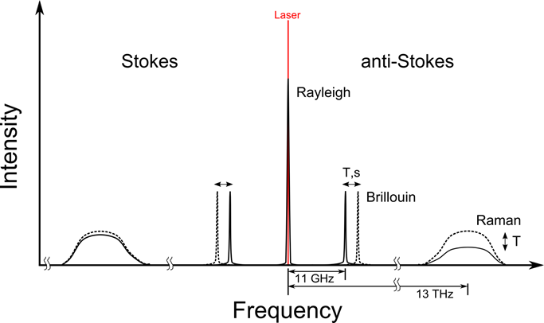<br>

- 布里渊散射用于温度和应变测量<br>
&nbsp;&nbsp; 布里渊散射需要更复杂的检测方案，因为其相对于激光线的频移很小。分析的布里渊频率取决于温度和应变，因此必须由系统分隔参数。
广泛用于与地面运动及其对基础设施（如管道，电缆，大坝，火车轨道，桥梁，隧道和建筑物）的影响相关的分布式应变传感（DSS）。结构监测。<br>

- 瑞利散射用于动态温度和应变测量<br>
&nbsp;&nbsp; 分布式声学传感（DAS）通常基于相干瑞利散射。来自多个散射中心的瑞利散射光的干涉导致了斑点图案，该斑点图案取决于叠加的光波之间的相位差。
图案对纤维长度的变化极为敏感；几十纳米的差异会导致典型波长约为1.5 µm的光发生明显的相位变化。<br>
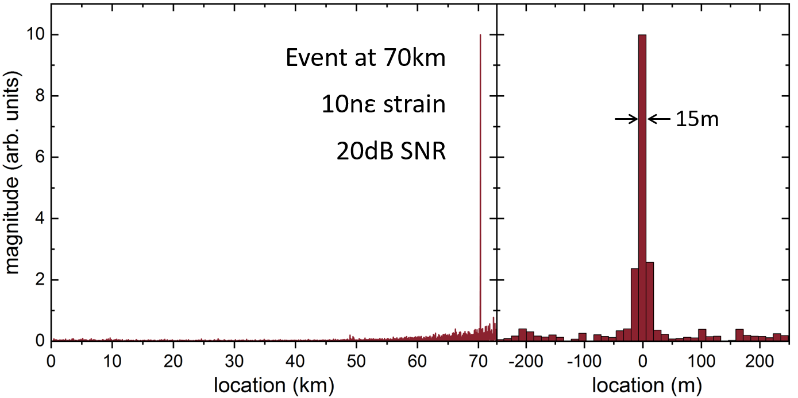<br>

- 拉曼散射用于温度感测<br>
&nbsp;&nbsp; 拉曼散射被广泛用于分布式温度感测（DTS），它使用简单的光学滤波器方案来测量反斯托克斯和斯托克斯分量的幅度，然后从它们的比率计算温度曲线。
主要应用领域是隧道和建筑物中的火灾探测，电力电缆监控，管道监控，油气井内监控以及地热/环境应用。<br>
&nbsp;&nbsp; 拉曼散射包括斯托克斯散射和反斯托克斯散射。斯托克斯散射是波长比入射光更长的光，而反斯托克斯散射是较短波长。<br>
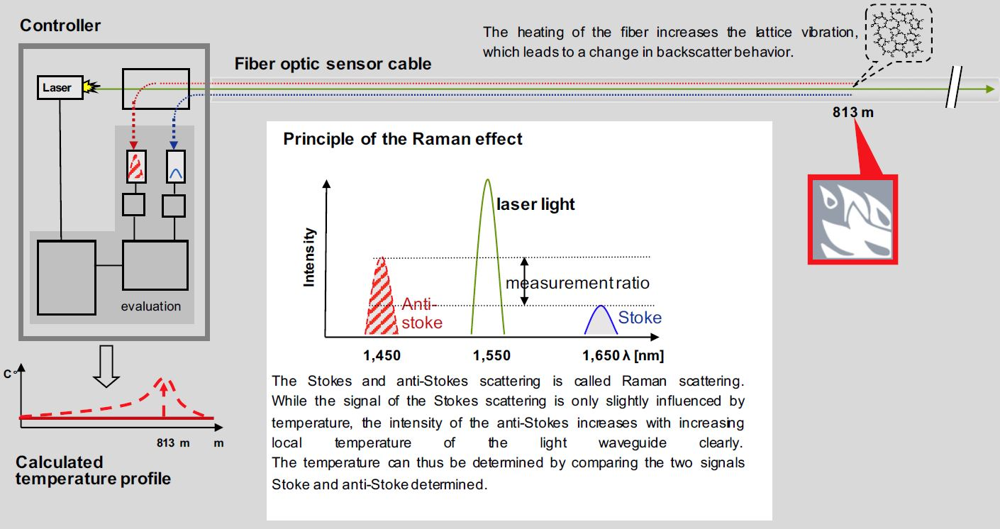<br>
尽管斯托克斯散射仅受温度的轻微影响，但反斯托克斯散射的强度随温度升高而增加。<br>
如果温度在某个位置发生变化，则DTS系统会计算出确切的温度​​和位置。<br>
通过测量斯托克斯强度和反斯托克斯强度之间的差来确定温度。这是通过激光源中的定向耦合器完成的。<br>
温度变化的位置是通过测量散射返回源所花费的时间来确定的，从而可以精确地确定变化的位置。<br>


---

<details>
<summary>光纤处理：</summary>

- 剥离切割并耦合到PCF：<a href="./sources/light/nkt/stripping_cleaving_and_coupling.pdf" target="_blank">PDF</a><br>  
- 拼接单模光子晶体光纤：<a href="./sources/light/nkt/splicing_single-mode_photonic_crystal_fibers.pdf" target="_blank">PDF</a><br>  
- 光纤刻面的损伤阈值：<a href="./sources/light/nkt/damage-threshold-of-fiber-facets-2012.pdf" target="_blank">PDF</a><br>  
</details><br>

<details>
<summary>超连续谱的产生：</summary>

- AeroGAIN-ROD-PM85放大ps脉冲：<a href="./sources/light/nkt/amplifying-ps-pulses-using-the-aerogain-rod-pm85.pdf" target="_blank">PDF</a><br>  
- [Layertec catalog](https://www.layertec.de/en/downloads/)<br>
- 光子晶体光纤中超连续谱的产生：<a href="./sources/light/nkt/Supercontinuum-General.pdf" target="_blank">PDF</a><br> 
超连续谱的产生是通过短的高功率脉冲通过非线性介质的传播而形成的宽连续光谱。
涉及的非线性效应取决于材料中的色散和计数效应，例如自相位调制（SPM），拉曼散射，相位匹配和孤子。<br>
- SCG-800 PCF：<a href="./sources/light/nkt/Supercontinuum-Generation-in-SCG-800.pdf" target="_blank">PDF</a><br>  
</details><br>

---

### 显示AR、VR

- [Radiant](https://www.radiantvisionsystems.com/zh-hans/blog)<br>

虚拟现实（VR）、增强现实（AR）和混合现实（MR）设备高度依赖近眼显示器（NED）的质量。<br>

<details>
<summary>包括：</summary>

- 亮度或色彩不均匀<br>
- 对比度问题<br>
- Mura（瑕疵）<br>
- 线和像素缺陷<br>
- 视角差异<br>
- 图像残留/重影（或像素切换响应时间）<br>
<a href="./sources/light/nkt/Light-Color-Poster.pdf" target="_blank">色度测量</a><br> 
显示器类型（LCD、LCOS、OLED或DLP）<br>
投影几何（透射式、反射式或半透反射式设计）<br>
光学（不透明、鸟池式、自由空间、光导、波导、曲面镜或定制光学元件）<br>
> 棱镜PBS方案：Google Glass<br>
> 曲面反射镜（虫眼）方案：Meta2<br>
> Birdbath方案：联想Mirage AR头显、ODG R9<br>
> 光波导（Optical Waveguide）方案：HoloLens 1、Magic Leap One、Lumus、Vuzix、Waveoptics、Digilens <br>

- 人眼<br>
视场（FOV）:平均而言，双眼水平FOV为200°，双眼重叠区域120°，垂直视场约为130°。<br>
瞳孔间距离（IPD）：50-75mm ，眼部缓解距离约12mm。<br>
瞳孔成型和非瞳孔成型架构。<br>
> FoV：视场<br>
> See-through：透视<br>
> Resolution：分辨率<br>
> Contrast Ratio：对比度<br>
> Luminance：亮度<br>
> Response time：响应时间<br>
> Reflectivity：反射率<br>
> Transparency ：透明度<br>

</details><br>

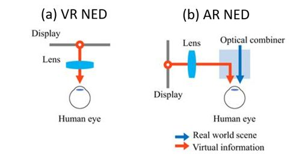<br>

#### 光波导

分为两类：阵列光波导（反射波导），另一类是衍射光波导（全息光波导）。浮雕光栅（SRG）全息波导、布拉格光栅（SBG）全息波导。<br>
- 全息波导<br>
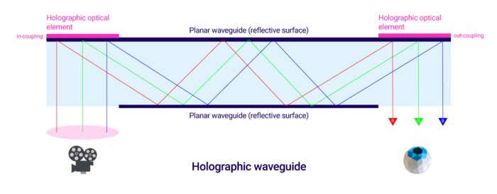<br>
- 衍射波导<br>
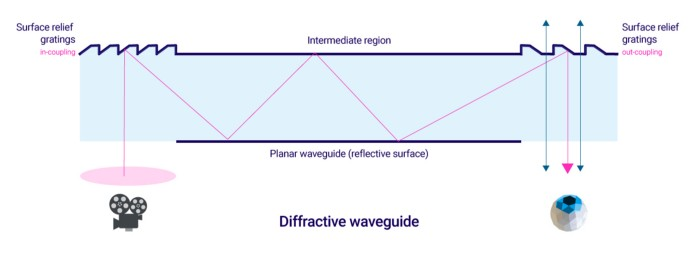<br>
- 偏振波导<br>
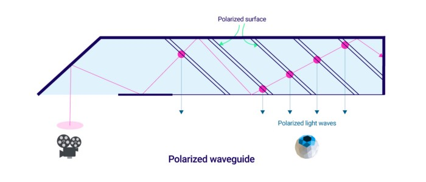<br>
- 反射波导<br>
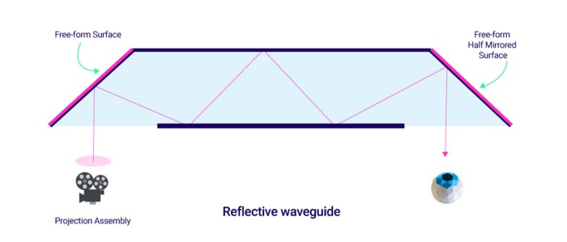<br>

#### 显示结构

- 完全沉浸式<br>
立体显示器与传感器结合在一起以跟踪位置和方向。<br>
- 光学透视<br>
可以直接通过光学元素（例如全息波导和其他可在现实世界中进行图形叠加的系统）查看现实。<br>
- 视频透视<br>
摄像头捕获现实图像，然后将这些相机视图与计算机生成的图像结合起来。<br>
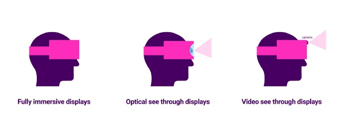<br>

- 液晶显示（LCD）<br>
- 有机发光二极管（OLED）<br>
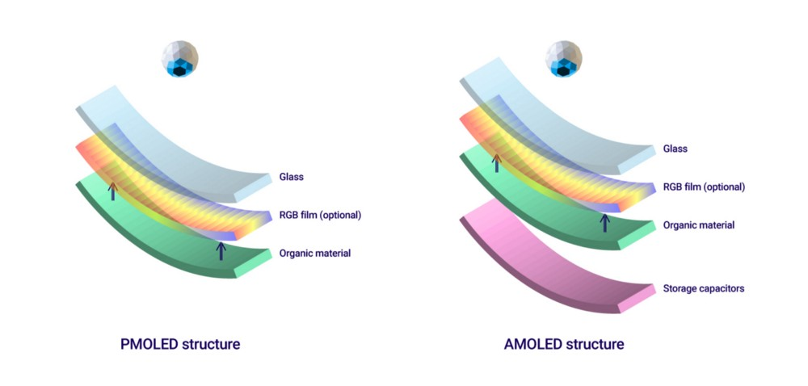<br>
- 数字投影微型显示（DLP）<br>
&nbsp;&nbsp; 也称为数字微镜器件（DMD），该显示器由大约200万个单独控制的微镜组成，每个微镜可用于表示单个像素，由MEMS控制。
这些微镜中的每一个的尺寸约为5.4微米。<br>
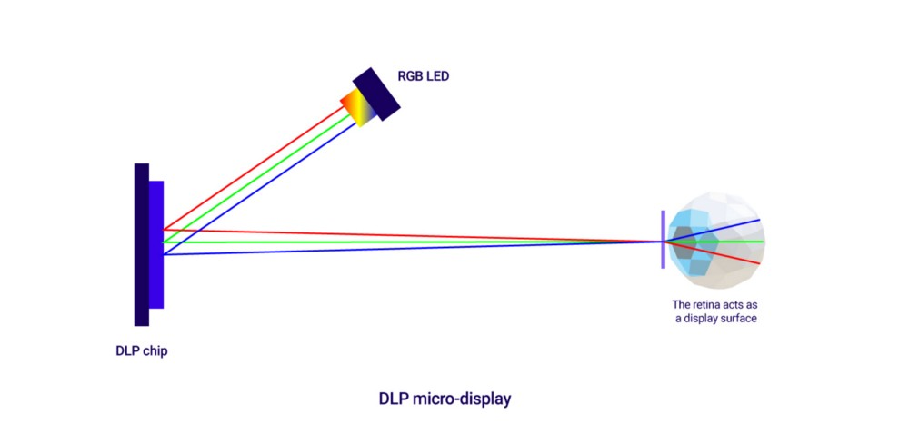<br>
- 硅基液晶微型显示（LCoS）<br>
&nbsp;&nbsp; LCoS显示器位于LCD和DLP显示器之间。
LCD是一种透射技术，其中图像被生成并传输给用户，而DLP是一种反射技术，其中各个子像素通过微镜反射。<br>
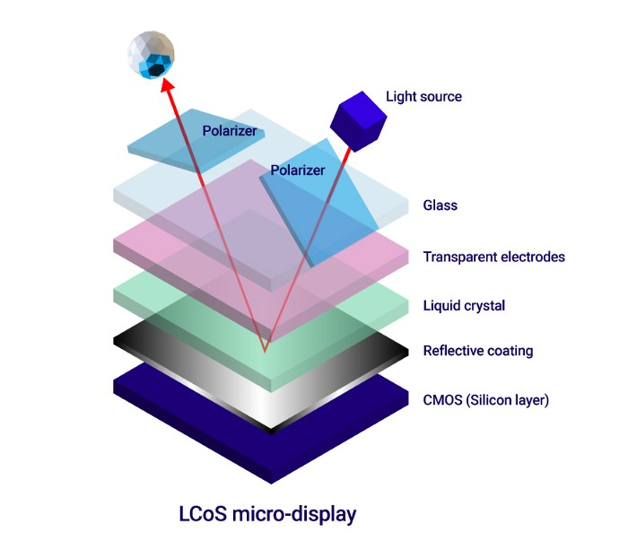<br>
- 激光光束扫描（LBS）<br><br> 
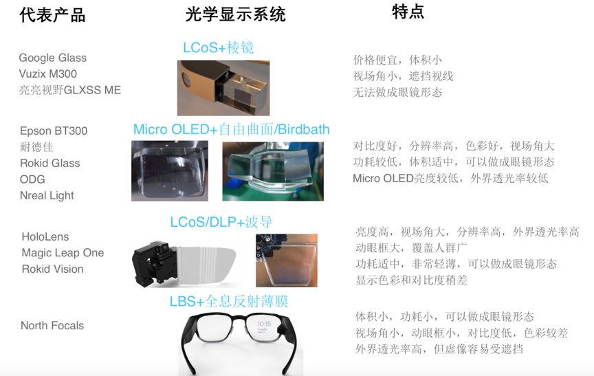<br>


#### 近眼显示

- 多焦面显示（Multi-focal ）：<br>
&nbsp;&nbsp; 以Magic Leap One 为代表，根据虚拟物体在虚拟空间中的远近位置，将其对应投影至两个及以上焦平面。
由于该技术存在无法实现连续焦距变化，实现所需光学系统复杂，光学系统复杂程度且制造成本随焦面数量增加而成指数级增加等诸多不足，
相比起其他可连续变焦或光场显示技术，具备一定过渡性质。<br>
- 可变焦显示器技术（Varifocal ）：<br>
&nbsp;&nbsp; 一般来讲，仅适用于VR设备，以Oculus Half Dome 原型机为代表，采用机械装置前后移动屏幕的位置来实现图像的焦距变化，
配合眼动追踪、注视点渲染等多种软硬件技术，模拟出人眼在观察远近不同物体时发生的屈光调节和双目辐辏调节过程。
可变焦显示器大量采用已成熟的技术作为实现基础，兼顾技术实现性和量产可行性，将成为下一代高端VR终端标配近眼显示技术。<br>
- 焦面显示器技术（Focal Surface）：<br>
&nbsp;&nbsp; 使用光相位调制器SLM把图像深度信息添加到普通2D屏幕画面中，让其在观察方向上模拟出图像的远近深度信息，
可作为近似的光场显示技术，目前Oculus将其定义为下二代VR显示的重要发展方向，
目前该技术存在结构复杂，所需SLM价格昂贵，图像分辨率、显示视场偏小等技术瓶颈有待攻克。<br>
- 光场显示(Light Field) ：<br>
&nbsp;&nbsp; 当前多种光场显示技术方案停留在实验室阶段，其技术路径和配套设备存在大量研发瓶颈，中近期均无法量产普及。
由于光场显示技术可以完全契合自然情况下人眼观察外界的原理，成为近眼显示领域追求的终极显示技术 。<br>


