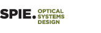

# 光学&光子学
> 资料整理、学习记录，OneNote备份。
---

## OneNoted

---
### [SPIE](./laser?id=相关资源)

- [SPIE Library](https://www.spiedigitallibrary.org/) 
[实验量子光学的基本概念和工具](https://doi.org/10.1117/12.2321658)：<a href="./sources/light/107410T.pdf" target="_blank">PDF</a>  
[超快薄盘多程激光放大器方案](https://doi.org/10.1117/1.OE.58.9.096102)：<a href="./sources/light/096102_1.pdf" target="_blank">PDF</a>  

[商业传感](https://www.spiedigitallibrary.org/conference-proceedings-of-spie/browse/SPIE-Defense-Commercial-Sensing/2020)|[智能材料结构与健康监测](https://www.spiedigitallibrary.org/conference-proceedings-of-spie/browse/SPIE-Smart-Structures-and-Materials-Nondestructive-Evaluation-and-Health-Monitoring/2020)|[欧洲光子学](https://www.spiedigitallibrary.org/conference-proceedings-of-spie/browse/SPIE-Photonics-Europe/2020)|[高级光刻](https://www.spiedigitallibrary.org/conference-proceedings-of-spie/browse/SPIE-Advanced-Lithography/2020)|[医学影像](https://www.spiedigitallibrary.org/conference-proceedings-of-spie/browse/SPIE-Medical-Imaging/2020)
:--:|:--:|:--:|:--:|:--:
||||
[AR/VR/MR](https://www.spiedigitallibrary.org/conference-proceedings-of-spie/browse/SPIE-AR-VR-MR/2020)|[西部光子学](https://www.spiedigitallibrary.org/conference-proceedings-of-spie/browse/SPIE-Photonics-West/2020)|[微纳材料器件及应用](https://www.spiedigitallibrary.org/conference-proceedings-of-spie/browse/SPIE-Micro-Nano-Materials-Devices-and-Applications/2019)|[亚洲光子学](https://www.spiedigitallibrary.org/conference-proceedings-of-spie/browse/SPIE-COS-Photonics-Asia/2019)|[光学制造](https://www.spiedigitallibrary.org/conference-proceedings-of-spie/browse/SPIE-Optifab/2019)
||||
[激光损伤](https://www.spiedigitallibrary.org/conference-proceedings-of-spie/browse/SPIE-Laser-Damage/2019)|[光掩模技术](https://www.spiedigitallibrary.org/conference-proceedings-of-spie/browse/SPIE-Photomask-Technology/2019)|[遥感](https://www.spiedigitallibrary.org/conference-proceedings-of-spie/browse/SPIE-Remote-Sensing/2019)|[安全防御](https://www.spiedigitallibrary.org/conference-proceedings-of-spie/browse/SPIE-Security-Defence/2019)|[光学光子学](https://www.spiedigitallibrary.org/conference-proceedings-of-spie/browse/SPIE-Optics-Photonics/2019)
||||
[光学计量](https://www.spiedigitallibrary.org/conference-proceedings-of-spie/browse/SPIE-Optical-Metrology/2019)|[欧洲生物医疗光学](https://www.spiedigitallibrary.org/conference-proceedings-of-spie/browse/SPIE-European-Conference-on-Biomedical-Optics/2019)|[光学光电子学](https://www.spiedigitallibrary.org/conference-proceedings-of-spie/browse/SPIE-Optics-Optoelectronics/2019)|[亚太遥感](https://www.spiedigitallibrary.org/conference-proceedings-of-spie/browse/SPIE-Asia-Pacific-Remote-Sensing/2018)|[SPIE商业传感](https://www.spiedigitallibrary.org/conference-proceedings-of-spie/browse/SPIE-Astronomical-Telescopes-Instrumentation/2018)
||||
[光学系统设计](https://www.spiedigitallibrary.org/conference-proceedings-of-spie/browse/SPIE-Optical-Systems-Design/2018)| | | | 
| | | | 

[会议演讲](https://www.spiedigitallibrary.org/conference-presentations) 

---
### Insights

- Resources：<a href="./sources/light/Technical Resources.pdf" target="_blank">PDF</a>  
- Thorlab：<a href="./sources/light/Thorlab.pdf" target="_blank">PDF</a>  
- reZonator介绍：<a href="./sources/light/reZonator.pdf" target="_blank">PDF</a>  
- 锁模固体激光：<a href="./sources/light/modelocking.pdf" target="_blank">PDF</a>  
- 学习整理：<a href="./sources/light/learn.pdf" target="_blank">PDF</a>  

---

[Photonics](https://www.rp-photonics.com/categories.html) 
