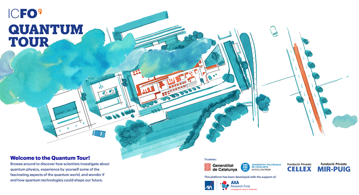
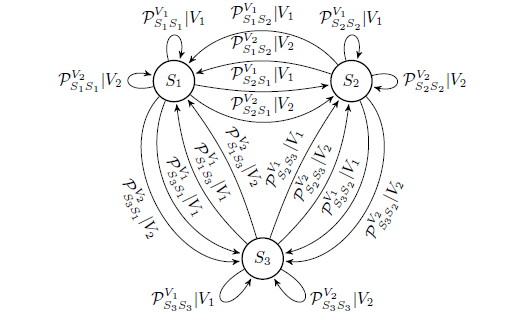

# 量子机器学习  
【[参考：Awesome](https://github.com/sindresorhus/awesome)】
> 精彩的量子机器学习、算法、软件、库等资料。

## 介绍 
---

### 为何选择量子机器学习？

 &nbsp;&nbsp;量子机器学习（Quantum ML）是量子物理学和机器学习（ML）相结合的跨学科领域。
它是一种共生关联 - 利用量子计算的力量来生成ML算法的量子版本，并应用经典的ML算法来分析量子系统。 
&nbsp;&nbsp;在2017年的一次<a href="https://www.youtube.com/watch?v=KJWMca0Hk6w">会议</a>上，
微软首席执行官萨蒂亚·纳德拉（Satya Nadella）使用玉米迷宫的类比来解释经典计算机和量子计算机之间的差异。
在试图找到一条通过迷宫的路径时，经典的计算机会沿着一条路径开始，遇到障碍物，然后回溯，再开始；
遇到另一个障碍物，再回溯，直到它没有选择。 虽然可以找到答案，但这种方法可能非常耗时。 
相比之下，量子计算机“解锁了惊人的并行性。他们同时走完了玉米迷宫中的每一条路。”
因此，导致解决问题所需的步骤数量呈指数减少。-- 并行性来自量子物理学的“量子比特”，“叠加”和“纠缠”概念。 
什么是机器学习？简单来说，就是让计算机或应用程序自学。
随着计算技术的发展的越来越快，数学进入这一领域，并通过计算将解决方案带入现实世界，如人工神经网络，DNA计算等。
在ML发展的的8到10年前，最大的障碍是将数学融入计算领域。
然后，谷歌，IBM，微软等顶级产品公司决定与数学家，医生和计算机科学人员组成一个团队，在这个领域提出各种想法。
该团队的成功制作了一些精彩的产品，他们首先使用该产品提供云服务。现在我们<a href="https://cloud.google.com/vision/">所处的阶段。</a>   
&nbsp;&nbsp;下一个阶段，计算领域必须从经典变为量子，并且开始在大量的量子计算领域工作，市场将这一领域称为量子信息科学。
这一开始来自Google和IBM的量子计算用于制作量子神经网络的处理器（D-Wave）。
量子计算机科学和量子信息科学领域将在未来10年内对AI进行重大改变。   
【<a href="https://research.google.com/pubs/QuantumAI.html">谷歌的QuantumAI</a>】 &nbsp;【<a href="http://research.ibm.com/ibm-q/">IBM的ibm-q</a>】
 
2016-2017：   
`https://www.chromeexperiments.com/experiment/quantum-computing-playground `   
`https://quantumexperience.ng.bluemix.net/qstage/#/qasm `   
2020 更新  

---

### 参考： 

<a href="https://www.dwavesys.com/quantum-computing ">D-Wave - 量子处理器</a>&nbsp;|&nbsp;
<a href="https://research.google.com/pubs/QuantumAI.html ">谷歌 - 量子人工智能实验室</a>&nbsp;|&nbsp;
<a href="http://research.ibm.com/ibm-q/ ">IBM - 量子计算机实验室</a>&nbsp;|&nbsp;
<a href="https://www.quora.com/Is-quantum-computing-the-future-of-AI ">Quora - 关于量子AI未来的问题</a>&nbsp;|&nbsp;
<a href="https://ti.arc.nasa.gov/tech/dash/physics/quail/ ">美国宇航局量子工程</a>&nbsp;|&nbsp;
<a href="https://www.youtube.com/watch?v=CMdHDHEuOUE ">量子处理器的谷歌视频</a>&nbsp;|&nbsp;
<a href="http://www.huffingtonpost.com/2013/07/29/quantum-computers-ai-artificial-intelligence-studies_n_3664011.html ">麻省理工学院评论</a>&nbsp;|&nbsp;
<a href="https://www.microsoft.com/en-us/quantum ">微软量子语言和开发套件</a>&nbsp;|&nbsp;
<a href="https://www.microsoft.com/en-us/research/project/language-integrated-quantum-operations-liqui/ ">微软量子相关作品</a>&nbsp;|&nbsp;
<a href="https://research.googleblog.com/2009/12/machine-learning-with-quantum.html ">谷歌量子机器学习博客</a>&nbsp;|&nbsp;
   

---

## 相关概念

### 量子之旅：  
- [Source](https://quantumtour.icfo.eu)  

---
### 量子相关

相关概念部分简单图示:  

**【量子】**
  
当激光与固体粒子碰撞时，原子的电子将在原子的轨道层之间旋转   

- 量子二极管:  

    
晶体管默认有源极，漏极和栅极，这里的源极是光子波，漏极是光通量，栅极是量子比特。  
- 量子晶体管:  

- 量子处理器:  

- QRAM:  

    
- PDF介绍: [PDF](https://arxiv.org/pdf/0807.4994.pdf)

**【叠加态】**

**【量子纠缠】**

**【Qubit】**

**【量子计算与经典计算】**

- [对比](http://www.thphys.nuim.ie/staff/joost/TQM/QvC.html)

---

## 量子计算

---
### 量子计算简介

&nbsp;&nbsp;正常Waves Interference是n维结构，找到一个多项式方程n阶曲线，更好的选项是复数。  

    
张量：
向量在二维向量空间中有一个方向，如果在一个维向量空间，向量方向可以用张量指定，
找到向量电子自旋空间叠加的最佳解决方案是将向量表示为张量并进行张量演算。   

---

### 量子机器学习算法

#### Quantum K-Nearest Neighbour (K值邻近)    
info : Here the centroid(euclidean distance) can be detected using the swap gates test between two states of the qubit , As KNN is regerssive loss can be tally using the average
- [理论解释](https://www.microsoft.com/en-us/research/publication/quantum-nearest-neighbor-algorithms-for-machine-learning/)
- [了解基本知识](https://arxiv.org/pdf/1409.3097.pdf)
- [将在Matlab上实现](https://github.com/krishnakumarsekar/)
- [将在Python上实现](https://github.com/krishnakumarsekar/)

#### Quantum K-Means (k均值)    
info : Two Approaches possible ,1. FFT and iFFT to make an oracle and calculate the means of superposition 2. Adiobtic Hamiltonian generation and solve the hamiltonian to determine the cluster
- [在图像上的应用](https://pdfs.semanticscholar.org/6d77/54d33958b4a41d57ec99558eb28ae88f9884.pdf)
- [理论简介](http://www.machinelearning.org/proceedings/icml2007/papers/518.pdf)
- [用哈密尔顿函数解释 K平均算法](https://arxiv.org/pdf/1307.0411.pdf)

#### Quantum Fuzzy C-Means (C均值模糊)    
info : As similar to kmeans fcm also using the oracle dialect ,but instead of means,here oracle optimization followed by a rotation gate is giving a good result
- [理论](https://pdfs.semanticscholar.org/6d77/54d33958b4a41d57ec99558eb28ae88f9884.pdf)

#### Quantum Support Vector Machine (向量机)    
info : A little different from above as here kernel preparation is via classical and the whole training be in oracles and oracle will do the classification, As SVM is linear ,An optimal Error(Optimum of the Least Squares Dual Formulation) Based regression is needed to improve the performance
- [介绍](https://arxiv.org/pdf/1307.0471.pdf)
- [应用](http://www.scirp.org/journal/PaperInformation.aspx?paperID=72542)

#### Quantum Genetic Algorithm (遗传算法)    
info : One of the best algorithm suited for Quantum Field ,Here the chromosomes act as qubit vectors ,the crossover part carrying by an evaluation and the mutation part carrying by the rotation of gates    

- [介绍](https://www.hindawi.com/journals/mpe/2013/730749/)
- [理论](https://arxiv.org/pdf/1202.2026.pdf)
- [对比](http://ccis2k.org/iajit/PDF/vol.9,no.3/2107-6.pdf)

#### Quantum Hidden Morkov Models (马尔科夫模型)    
info : As HMM is already state based ,Here the quantum states acts as normal for the markov chain and the shift between states is using quantum operation based on probability distribution    

- [文章1](https://arxiv.org/pdf/1503.08760.pdf)
- [文章2](https://arxiv.org/pdf/1207.4304.pdf)

#### Quantum state classification with Bayesian methods (叶贝斯)    
info : Quantum Bayesian Network having the same states concept using quantum states,But here the states classification to make the training data as reusable is based on the density of the states(Interference)    

 
- [理论](https://arxiv.org/pdf/1204.1550.pdf)
- [介绍](https://www.ncbi.nlm.nih.gov/pmc/articles/PMC4726808/)

#### Quantum Ant Colony Optimization (蚁群算法)    
info : A good algorithm to process multi dimensional equations, ACO is best suited for Sales man issue , QACO is best suited for Sales man in three or more dimension, Here the quantum rotation circuit is doing the peromene update and qubits based colony communicating all around the colony in complex space    

- [概念](http://ac.els-cdn.com/S2212667812001359/1-s2.0-S2212667812001359-main.pdf?_tid=42e0cd66-2f4a-11e7-920f-00000aacb361&acdnat=1493738345_8f536599e404c7588811ddd49c484688)
- [应用](http://www.sersc.org/journals/IJMUE/vol10_no11_2015/19.pdf)

#### Quantum Cellular Automata (元胞自动机)    
info : One of the very complex algorithm with various types specifically used for polynomial equations and to design the optimistic gates for a problem, Here the lattice is formed using the quatum states and time calculation is based on the change of the state between two qubits ,Best suited for nano electronics    

- [相关](https://arxiv.org/pdf/0808.0679.pdf)
- [应用](http://ieee-hpec.org/2013/index_htm_files/7-Improved-Eigensolver-Baldwin-2867489.pdf)

---

### QAUNTUM NEURAL NETWORK (神经网络)

&nbsp;&nbsp;Its really one of the hardest topic , To understand easily ,Normal Neural Network is doing parallel procss ,QNN is doing parallel of parallel processess ,
In theory combination of various activation functions is possible in QNN .
In Normal NN more than one activation function reduce the performance and increase the complexity .    

   
量子感知    

- [理论](https://arxiv.org/pdf/quant-ph/0201144.pdf)
- [介绍](http://axon.cs.byu.edu/papers/ricks.nips03.pdf/)

---

### QAUNTUM STATISTICAL DATA ANALYSIS (统计数据分析)

&nbsp;&nbsp;An under research concept ,It can be seen in multiple ways, 
one best way if you want to apply n derivative for a problem in current classical theory its difficult to compute as its 
serialization problem instead if you do parallelization of differentiation 
you must estimate via probability the value in all flows ,
Quantum Probability Helps to achieve this ,as the loss calculation is very less . 
the other way comparatively booming is Quantum Bayesianism, 
its a solution to solve most of the uncertainity problem in statistics to combine time and 
space in highly advanced physical research .    

---

## 实验平台

---

### 量子程序设计语言、平台、工具及软件

   

【模拟器集合：很不错】
- [QC simulation](https://www.quantiki.org/wiki/list-qc-simulators)

【Python中的Quantum工具箱】
- [QuTiP](http://qutip.org/)

【基于Matlab的量子信息工具包：】
- [QIT](https://pypi.org/project/qit/) - `pip install qit `

【张量网络机器学习】
- [TNML](https://github.com/emstoudenmire/TNML)

【Rigetti：不错的工具库】
- [Github](https://github.com/rigetti)
- [提供Api](https://www.rigetti.com/forest)

【Artiste-qb】
- [artiste-qb](http://artiste-qb.net/)
- [Github](https://github.com/artiste-qb-net)

【Qiskit】
- [Github](https://github.com/QISKit)
- [主页](https://qiskit.org/)

【IBM的Bluemix模拟器】
- [Bluemix模拟器](https://quantumexperience.ng.bluemix.net/qx/editor)

【Microsoft Quantum开发套件】
- [Visual Studio Quantum开发套件](https://marketplace.visualstudio.com/items?itemName=quantum.DevKit)
- [Q#](https://docs.microsoft.com/en-us/quantum/quantum-WriteAQuantumProgram?view=qsharp-preview)

【IBM Quantum Computer的API】
- [Qiskit](https://github.com/Qiskit/qiskit-ibmq-provider) - `pip install qiskit`

【Python ToolKit量子算法模拟项目存储库】
- [QML](https://github.com/qmlcode/qml)

【一个quantumlib】
- [OpenFermion](https://github.com/quantumlib)

【通过张量网络机器学习进行药物研发】
- [初创公司](http://gtn.ai/)

【谷歌量子AI博客数据库(翻墙)】
- [数据库](https://ai.google/research/pubs?area=QuantumAI)
- [Blog](https://ai.googleblog.com/)

【QUANTUM +机器学习】
- [Xanadu](https://www.xanadu.ai/)

【Fathom Computing】
- [主页](https://www.fathomcomputing.com/)

【CAS-Alibaba量子计算实验室】
- [主页](http://quantumcomputer.ac.cn/)

【用于原子系统的深度神经网络】
- [Schnetpack](https://github.com/atomistic-machine-learning/schnetpack) - `pip install schnetpack`

【Google Tensor Network】
- [Github](https://github.com/google/TensorNetwork)

【Google在工具方面如：CircQ 】
- [Google Works](https://research.google/teams/applied-science/quantum/)

---

## 量子机器学习与深度学习

---
&nbsp;&nbsp;所有的经典算法都是基于串行处理的，它依赖于第一个循环的反馈，在多机群中应用串行经典算法并不能得到很好的结果，
但是一些轻量级的并行经典算法(深度学习)在多机群中执行任务，不适用于复杂问题，那么该算法的解决方案是什么？ 
&nbsp;&nbsp;正如《量子机器学习》一书中所说，深度学习的优势在于可以简单地对数据进行批处理，而量子机器学习则是根据算法进行批处理。
   
【相关讨论：】  

- [PDF](http://www.scottaaronson.com/papers/qml.pdf)
- [Google](https://venturebeat.com/2015/11/11/google-researcher-quantum-computers-arent-perfect-for-deep-learning/)
- [Microsoft](http://www.physics.usyd.edu.au/quantum/Coogee2015/Presentations/Svore.pdf)
- [IBM](https://www.rtinsights.com/ibm-quantum-computing-with-machine-learning-in-cloud/)
- [IBM Project](https://www.ibm.com/blogs/research/2017/03/quantum-algorithm-classifies-9500-handwritten-numbers/)
- [MIT and Google ](https://www.technologyreview.com/s/544421/googles-quantum-dream-machine/)
- [Quora 1(翻墙)](https://www.quora.com/How-will-quantum-computing-revolutionize-deep-learning)
- [Quora 2(翻墙)](https://www.quora.com/Will-quantum-computing-change-machine-learning)

---

## 讨论组 Meetup

---
【相关组织：】  
* [Meetup 1](https://www.meetup.com/Quantum-Computing-and-Big-Data/events/past/) - 量子计算与数据科学
* [Meetup 2](https://www.meetup.com/London-Quantum-Computing-Meetup/) - 伦敦.量子计算
* [Meetup 3](https://www.meetup.com/New-York-Quantum-Computing-Meetup/) - 纽约.量子计算
* [Meetup 4](https://www.meetup.com/Austin-Quantum-Computing-Artificial-Intelligence-Meetup/) - 奥斯汀.量子计算 
* [Meetup 5](https://www.meetup.com/The-NY-Quantum-Theory-Group/) - 纽约.量子理论
* [Meetup 6](https://www.meetup.com/Quantum-Computers/) - 加利福利亚.量子理论
* [Meetup 7](https://www.meetup.com/nyhackr/) - 纽约.开放统计编程
* [Meetup 8](https://www.meetup.com/Quantum-Physics-Meetup-Group/) - 伦敦.神经科学
* [Meetup 9](https://www.meetup.com/Relativity-Exploration-of-Portland/) - 波特兰数学与科学小组
* [Meetup 10](https://www.meetup.com/Quantum-Physics-Discussion-Group/) - 加利福利亚.量子物理讨论组
* [Meetup 11](https://www.meetup.com/Theoretical-Quantum-Mechanics/) - 宾夕法尼亚.量子力学

---

## 课程

---

【相关课程参考：】    

- [量子力学](https://www.icourse163.org/course/SJTU-1003674003)
- [量子力学和计算机](https://inst.eecs.berkeley.edu/~cs191/fa14/)
- [量子计算](https://www.pluralsight.com/courses/quantum-computing-big-picture)
- [D-Wave.量子计算](https://www.dwavesys.com/tutorials/background-reading-series/quantum-computing-primer)
- [微软.量子计算](https://brilliant.org/courses/quantum-computing/)
- [量子物理学.MIT](https://ocw.mit.edu/courses/physics/8-04-quantum-physics-i-spring-2013/)
- [量子计算.MIT](https://ocw.mit.edu/courses/mathematics/18-435j-quantum-computation-fall-2003/index.htm)
- [量子计算](https://uwaterloo.ca/institute-for-quantum-computing/)
- [量子物理学.Niels Bohr](https://www.nbi.ku.dk/english/research/quantum-physics/)
- [新加坡](https://www.quantumlah.org/)
- [慕尼黑](http://www.munich-quantum-center.de/index.php?id=89)
- [量子信息科学课程](https://www.quantiki.org/wiki/courses-quantum-information-science)
- [量子信息科学](https://ocw.mit.edu/courses/media-arts-and-sciences/mas-865j-quantum-information-science-spring-2006/)
- [量子信息](http://qis.mit.edu/courses.php)
- [量子信息](http://quic.ulb.ac.be/teaching)
- [量子信息.UMD](http://quics.umd.edu/research)
- [量子信息](https://web.stanford.edu/group/yamamotogroup/)
- [奥地利](https://iqoqi.at/en)
- [量子电子学](https://ocw.mit.edu/courses/electrical-engineering-and-computer-science/6-974-fundamentals-of-photonics-quantum-electronics-spring-2006/)
- [量子电子学和光学](http://www.ece.utexas.edu/research/areas/plasma-quantum-electronics-and-optics)
- [ICFO](http://quantumtech.icfo.eu/madeicfo/)
- [相对论量子场论](https://ocw.mit.edu/courses/physics/8-323-relativistic-quantum-field-theory-i-spring-2008/)
- [量子场论与弦理论](https://itp.phys.ethz.ch/research/qftstrings.html)
- [量子科学与技术](https://nccr-qsit.ethz.ch/)
- [有效场论](https://courses.edx.org/courses/MITx/8.EFTx/3T2014/course/)
- [量子计算机科学](https://www.cs.ox.ac.uk/teaching/courses/quantum/)
- [PSI](https://perimeterinstitute.ca/training/psi-masters-program/psi-courses)
- [机器学习数学](https://ocw.mit.edu/courses/mathematics/18-657-mathematics-of-machine-learning-fall-2015/)
- [Quora 1(翻墙)](https://www.quora.com/Quantum-Computing-vs-Artificial-Intelligence-for-a-PhD)
- [Quora 2(翻墙)](uora.com/Where-can-you-get-a-PhD-in-quantum-machine-learning)

---

## 综合资源

---

【博客、论坛、Paper等】     

- [FOSDEM 2020量子会谈](https://fosdem.org/2020/schedule/track/quantum_computing/)
- [FOSDEM 2019量子会谈](https://fosdem.org/2019/schedule/track/quantum_computing/)
- [Max Planck](https://qumoptly.github.io/blog/2019/07/18/%E5%85%B3%E4%BA%8E%E9%A9%AC%E5%85%8B%E6%96%AF%E6%99%AE%E6%9C%97%E5%85%8B%E9%87%8F%E5%AD%90%E5%85%89%E5%AD%A6%E7%A0%94%E7%A9%B6%E6%89%80/) -关于马克斯普朗克研究所收集的部分资料
- [Gla.ac](https://qumoptly.github.io/blog/2019/07/18/%E5%85%B3%E4%BA%8E%E6%A0%BC%E6%8B%89%E6%96%AF%E5%93%A5/) - 关于Glasgow上收集的部分资料
- [彼得威特克](http://peterwittek.com/index.html)
- [热门arXiv](https://scirate.com/) - arxiv.org
- [量子科技](https://medium.com/quantum-tech) - 追踪量子技术的发展，订阅月度邮件列表：https://eepurl.com/c10FJz 
- [量子客](https://www.qtumist.com/links)
- [Facebook](https://www.facebook.com/quantummachinelearning) - 量子机器学习与量子人工智能
- [Linkdin](https://www.linkedin.com/groups/8592758)
- [Yuezhen Niu](https://scholar.google.com/citations?user=0wJPxfkAAAAJ&hl=en)    

   

   

---

【其他】

**腾云漫画：** 如若侵权，则删除。   

---

  
【若侵权可删除】

---

## 感谢！

 By qumoptly | 2019.7&nbsp;&nbsp;

